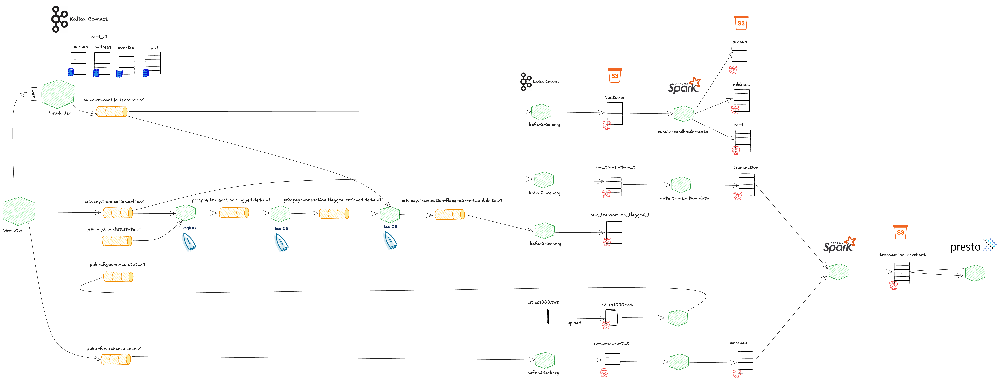
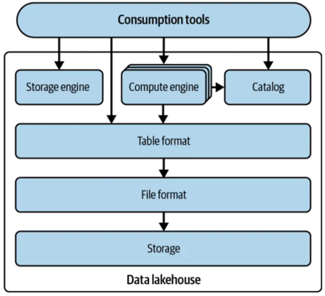
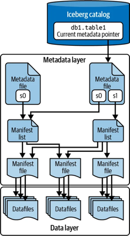
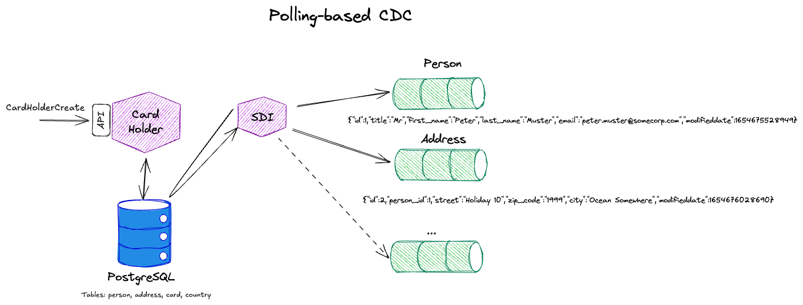
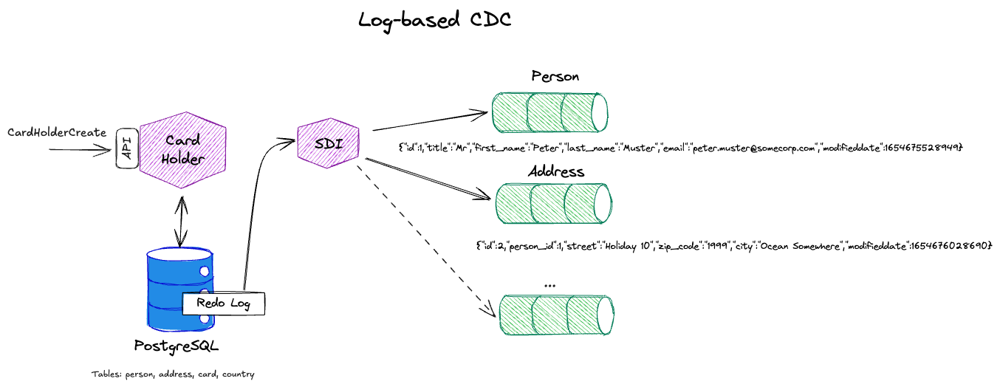
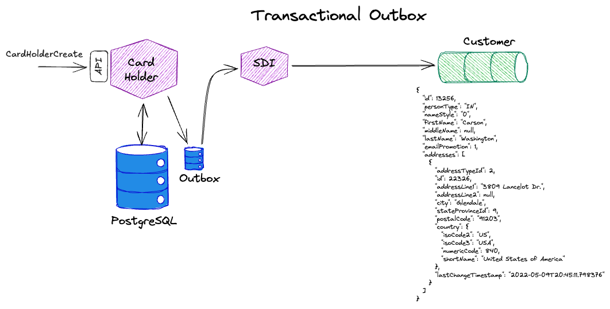
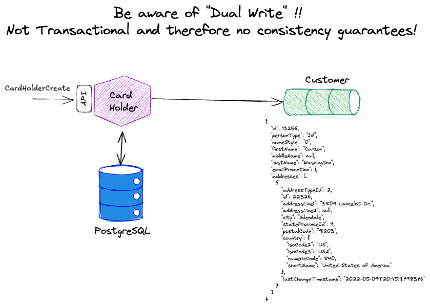
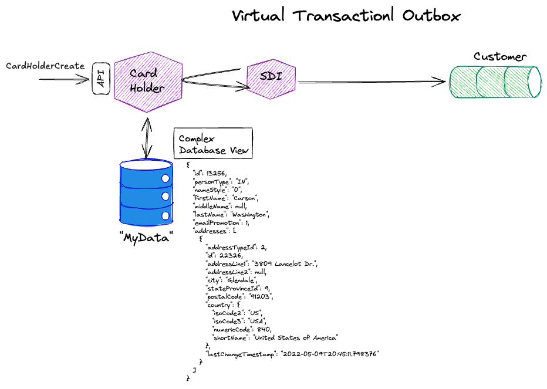

# Credit Card Fraud End-to-End Streaming Demo




The platform for this demo has been created using the [Platys - Platorm in a box](http://github.com/trivadispf/platys) toolkit. 

It can be combined with WatsonX.data Developer edition and use Minio, MDS and Presto from there. 

## 00 - Starting the Platform

### Start base services

```bash
export PUBLIC_IP=
export DOCKER_HOST_IP=localhost
export DATAPLATFORM_IP=localhost

docker compose up -d
```

### Start simulator

```bash
docker compose --profile test up -d
```


## 01 - KSQL transaction stream processing


``` bash
docker exec -it ksqldb-cli ksql http://ksqldb-server-1:8088
```

### Prepare KSQL Stream `pay_transaction_s`

``` sql
CREATE STREAM IF NOT EXISTS pay_transaction_s 
  WITH (kafka_topic='priv.pay.transaction.delta.v1',
        value_format='AVRO');
```

```sql
SELECT * FROM pay_transaction_s EMIT CHANGES;
```

```sql
SELECT card_number, COUNT(*) AS nof 
FROM pay_transaction_s
GROUP BY card_number
EMIT CHANGES;
```

```sql
SELECT
  TIMESTAMPTOSTRING(WINDOWSTART, 'yyyy-MM-dd HH:mm:ss', 'UTC') AS window_start,
  TIMESTAMPTOSTRING(WINDOWEND, 'yyyy-MM-dd HH:mm:ss', 'UTC') AS window_end,
  card_number,
  COUNT(*) AS nof,
  SUM(amount) AS sum
FROM pay_transaction_s
WINDOW TUMBLING (SIZE 1 MINUTE)
GROUP BY card_number
EMIT CHANGES;
```

```sql
SELECT
  TIMESTAMPTOSTRING(WINDOWSTART, 'yyyy-MM-dd HH:mm:ss', 'UTC') AS window_start,
  TIMESTAMPTOSTRING(WINDOWEND, 'yyyy-MM-dd HH:mm:ss', 'UTC') AS window_end,
  card_number,
  COUNT(*) AS nof,
  SUM(amount) AS sum
FROM pay_transaction_s
WINDOW TUMBLING (SIZE 1 MINUTE)
GROUP BY card_number
HAVING COUNT(*) > 1
EMIT CHANGES;
```

### Prepare black list table and use it to flag problematic transactions

```sql
CREATE TABLE IF NOT EXISTS pay_blacklist_t (key VARCHAR PRIMARY KEY, merchant_id VARCHAR)
WITH (kafka_topic='priv.pay.blacklist.state.v1',
        value_format='AVRO', key_format='AVRO');
```

let's join the transaction stream with the blacklist table

```sql
SELECT t.*
	, CASE 
			WHEN bl.key IS NOT NULL 
			THEN 1 else 0 
		END 					AS is_flagged
	, CASE 
			WHEN bl.key IS NOT NULL 
			THEN 'blacklist' else ''
		END 					AS flagged_reason		
FROM pay_transaction_s		t
LEFT JOIN pay_blacklist_t  bl
ON (t.merchant_id = bl.key)
EMIT CHANGES;
```

As the black list is currently empty, no transaction is flagged, which is of course ok!

In another terminal, insert a merchant into the black list table

``` bash
docker exec -it ksqldb-cli ksql http://ksqldb-server-1:8088
```

```sql
INSERT INTO pay_blacklist_t (key, merchant_id)
VALUES ('merchant-199', 'merchant-199');
```

You should no start to see some flagged transactions in the other window. As it is a bit hard to spot among the many non-problematic transactions, let's just slect the ones where the flag is not `0`. 

Stop the query. 

For doing that, we persist the join into another stream

```
DROP STREAM IF EXISTS pay_transaction_flagged_enriched_s;
DROP STREAM IF EXISTS pay_transaction_flagged_s;

CREATE STREAM pay_transaction_flagged_s
  WITH (kafka_topic='priv.pay.transaction-flagged.delta.v1',
        value_format='AVRO', key_format='AVRO', partitions=2)
AS
	SELECT t.transaction_id
	, t.card_number
	, t.currency
	, t.amount
	, t.merchant_id
	, t.channel
	, t.transaction_date
	, CASE 
			WHEN bl.key IS NOT NULL 
			THEN 1 else 0 
		END 					AS is_flagged
	, CASE 
			WHEN bl.key IS NOT NULL 
			THEN 'blacklist' else ''
		END 					AS flagged_reason
	FROM pay_transaction_s		t
	LEFT JOIN pay_blacklist_t  bl
		ON (t.merchant_id = bl.key)
	EMIT CHANGES; 
```

Now let' only view the flagged transactions

```sql
SELECT * 
FROM pay_transaction_flagged_s 
WHERE is_flagged = 1 
EMIT CHANGES;
```

if you think it takes to long, you can of course add other merchants to the blacklist. 

### Prepare table `mer_merchant_t` and join it to transactions

```sql
CREATE TABLE IF NOT EXISTS ref_merchant_t (key STRING PRIMARY KEY)
  WITH (kafka_topic='pub.ref.merchant.state.v1',
        value_format='AVRO', key_format='AVRO');
```

```sql
SELECT t.*
		, m.name 				AS merchant_name
		, m.country
		, m.city
		, m.category_name
FROM pay_transaction_flagged_s		t
LEFT JOIN ref_merchant_t m
	ON (t.merchant_id = m.key)
EMIT CHANGES; 
```

```sql
DROP STREAM IF EXISTS pay_transaction_flagged_enriched_s;

CREATE STREAM pay_transaction_flagged_enriched_s
  WITH (kafka_topic='priv.pay.transaction-flagged-enriched.delta.v1',
        value_format='AVRO', key_format='AVRO', partitions=2)
AS
	SELECT t.transaction_id
		, t.card_number
		, t.currency
		, t.amount
		, t.channel
		, t.transaction_date
		, t.is_flagged
		, t.flagged_reason
		, t.merchant_id		AS merchant_id
		, m.name 				AS merchant_name
		, m.country
		, m.city
		, m.category_name
	FROM pay_transaction_flagged_s		t
	LEFT JOIN ref_merchant_t m
		ON (t.merchant_id = m.key)
	EMIT CHANGES; 
```

```sql
SELECT * 
FROM pay_transaction_flagged_enriched_s
EMIT CHANGES;
```

```sql
SELECT * 
FROM pay_transaction_flagged_enriched_s
WHERE is_flagged = 1 
EMIT CHANGES;
```

### Unusually large transactions (only after `cardHolder` are available)

```sql
	SELECT t.transaction_id
		, t.card_number
		, t.currency
		, t.amount
		, t.channel
		, t.transaction_date
		, CASE WHEN (t.amount > 200) 
				THEN t.is_flagged + 1 
				ELSE t.is_flagged 
		  END AS is_flagged
		, CASE WHEN (t.amount > 200) 
				THEN CONCAT(t.flagged_reason, ',', 'high-amount')
				ELSE t.flagged_reason
		  END AS flagged_reason
		, t.merchant_id		AS merchant_id
		, t.merchant_name
		, t.country
		, t.city
		, t.category_name
	FROM pay_transaction_flagged_enriched_s  t
	PARTITION BY t.card_number
	EMIT CHANGES; 
```

```sql
CREATE STREAM IF NOT EXISTS cus_cardholder_s
WITH (kafka_topic='pub.cus.cardHolder.state.v1',
        value_format='AVRO');
```


```sql
CREATE STREAM IF NOT EXISTS cus_cardholder_by_card_number_s
AS
SELECT * FROM cus_cardholder_s c
PARTITION BY c.card_holder->card->number
EMIT CHANGES; 
```

```sql
CREATE TABLE IF NOT EXISTS cus_cardholder_t (key VARCHAR PRIMARY KEY)
WITH (kafka_topic='CUS_CARDHOLDER_BY_CARD_NUMBER_S',
        value_format='AVRO');
```

```sql
CREATE STREAM pay_transaction_flagged2_enriched_s
  WITH (kafka_topic='priv.pay.transaction-flagged2-enriched.delta.v1',
        value_format='AVRO', key_format='AVRO', partitions=2)
AS
	SELECT t.transaction_id
		, t.card_number
		, t.currency
		, t.amount
		, t.channel
		, t.transaction_date
		, CASE WHEN (t.amount > card_holder->avg_transaction_amount) 
				THEN t.is_flagged + 1 
				ELSE t.is_flagged 
		  END AS is_flagged
		, CASE WHEN (t.amount > card_holder->avg_transaction_amount) 
				THEN CONCAT(t.flagged_reason, ',', 'high-amount')
				ELSE t.flagged_reason
		  END AS flagged_reason
		, t.merchant_id		AS merchant_id
		, t.merchant_name
		, t.country
		, t.city
		, t.category_name
		, c.card_holder->avg_transaction_amount
	FROM pay_transaction_flagged_enriched_s  t
	LEFT JOIN cus_cardholder_t c
		ON (t.card_number = c.key)
	PARTITION BY t.card_number
	EMIT CHANGES; 
```


### Geo Enrichment (only after `geolocations` are available)


```sql
CREATE TABLE IF NOT EXISTS ref_geonames_t (key VARCHAR PRIMARY KEY, name VARCHAR, latitude DOUBLE, longitude DOUBLE)
WITH (kafka_topic='priv.ref.geonames.state.v1',
        value_format='JSON');
```

```sql
SELECT *
FROM pay_transaction_flagged_enriched_s t
LEFT JOIN ref_geonames_t g
  ON t.city = g.key
EMIT CHANGES;
```

```sql
DROP STREAM pay_transaction_flagged_enriched_s_p1;

CREATE STREAM pay_transaction_flagged_enriched_s_p1
WITH (kafka_topic='priv.pay.transaction_flagged_enriched_part1.state.v1', partitions=1) AS
SELECT *
FROM pay_transaction_flagged_enriched_s
PARTITION BY city
EMIT CHANGES;
```

```sql
SELECT *
FROM pay_transaction_flagged_enriched_s_p1 t
LEFT JOIN ref_geonames_t g
  ON t.city = g.key
EMIT CHANGES;
```

## 02 - Write Transactions as Iceberg tables to S3 Object Storage using Kafka Connect

What is file format? and what is a table format?



We are using [Apache Iceberg](https://iceberg.apache.org/) table format in this demo.

### Preopare the Raw Transactions Iceberg table

#### Using Spark SQL to create the table

```bash
docker exec -ti spark-master spark-sql
```

change `hiverest` to `watson` to connect to WatsonX developer edition. 

```sql
use hiverest;

CREATE DATABASE payment_db
LOCATION 's3a://iceberg-bucket/payment_db';

CREATE TABLE payment_db.raw_transaction_t (
    transaction_id STRING,
    card_number STRING,
    currency STRING,
    amount DOUBLE,
    merchant_id STRING,
    channel STRING,
    transaction_date TIMESTAMP)
PARTITIONED BY (hours(transaction_date));
```

Create the bucket (should already been created in the startup)

```bash
docker exec -ti minio-mc mc mb minio-1/iceberg-bucket
```

* <http://dataplatform:9000> - Local
	* User: `admin`
   * Password: `abc123abc123!`
* <http://ibm-lh-presto-svc:9000> - IBM WatsonX.data Dev 
	* User: `f33150f834d9a8b2435474f6`
   * Password: `fdd7d613b2c72d07c3618ae6`




#### Kafka Connect (local) - write to `payment_db.raw_transaction_t`


* which connectors are available

```
curl -X "GET" "$DOCKER_HOST_IP:8083/connector-plugins" | jq
```

* Kafka Connect UI: <http://dataplatform:28103>

Create the `control-iceberg` control topic, needed for the Kafka Connect [Iceberg Connector](https://iceberg.apache.org/docs/nightly/kafka-connect/) to work. 

```bash
docker exec -it kafka-1 kafka-topics --bootstrap-server kafka-1:19092 --create --topic control-iceberg --partitions 1 --replication-factor 3
```
#### Kafka Connect (Local)

```bash
curl -X PUT \
  http://$DATAPLATFORM_IP:8083/connectors/pay-transaction-kafka-to-s3/config \
  -H 'Content-Type: application/json' \
  -H 'Accept: application/json' \
  -d '{
      "connector.class": "org.apache.iceberg.connect.IcebergSinkConnector",
      "tasks.max": "1",
      "topics": "priv.pay.transaction.delta.v1",
      "iceberg.tables": "payment_db.raw_transaction_t",
      "iceberg.tables.dynamic-enabled": "false",
      "write.upsert.enabled": "false",
      "iceberg.control.commit.interval-ms": "60000",
      "consumer.max.poll.records": "5000",
      "iceberg.catalog.type": "rest",
      "iceberg.catalog.uri": "http://hive-metastore:9084/iceberg",
      "iceberg.catalog.warehouse": "s3a://iceberg-bucket/payment_db",      
      "iceberg.catalog.client.region": "us-east-1",
      "iceberg.catalog.s3.endpoint": "http://minio-1:9000",
      "iceberg.catalog.s3.path-style-access": "true",
      "iceberg.catalog.s3.access-key-id": "admin",
      "iceberg.catalog.s3.secret-access-key": "abc123abc123!",
      "value.converter": "io.confluent.connect.avro.AvroConverter",
      "value.converter.schema.registry.url": "http://schema-registry-1:8081",
      "key.converter": "org.apache.kafka.connect.storage.StringConverter"
	}'
```

#### Kafka Connect (Watson.x Data)

```
curl -X PUT \
  http://$DATAPLATFORM_IP:8083/connectors/IBM_pay-transaction-kafka-to-s3/config \
  -H 'Content-Type: application/json' \
  -H 'Accept: application/json' \
  -d '{
      "connector.class": "org.apache.iceberg.connect.IcebergSinkConnector",
      "tasks.max": "1",
      "topics": "priv.pay.transaction.delta.v1",
      "iceberg.tables": "payment_db.raw_transaction_t",
      "iceberg.tables.dynamic-enabled": "false",
      "write.upsert.enabled": "false",
      "iceberg.control.commit.interval-ms": "60000",
      "consumer.max.poll.records": "5000",
      "iceberg.catalog.type": "rest",
      "iceberg.catalog.uri": "https://ibm-lh-presto-svc:8180/mds/iceberg",
      "iceberg.catalog.warehouse": "iceberg_data",      
      "iceberg.catalog.client.region": "none",
      "iceberg.catalog.s3.endpoint": "http://ibm-lh-presto-svc:9000",
      "iceberg.catalog.s3.path-style-access": "true",
      "iceberg.catalog.s3.access-key-id": "f33150f834d9a8b2435474f6",
      "iceberg.catalog.s3.secret-access-key": "fdd7d613b2c72d07c3618ae6",
  	   "iceberg.catalog.rest.auth.type": "basic",
      "iceberg.catalog.rest.auth.basic.username": "admin",
      "iceberg.catalog.rest.auth.basic.password": "abc123abc123!",
      "value.converter": "io.confluent.connect.avro.AvroConverter",
      "value.converter.schema.registry.url": "http://schema-registry-1:8081",
      "key.converter": "org.apache.kafka.connect.storage.StringConverter"
	}'
```

### Flagged Transactions to Iceberg

```bash
docker exec -ti spark-master spark-sql
```

```sql
# either use `hiverest` or `watson`

DROP TABLE IF EXISTS payment_db.raw_transaction_flagged_t;

CREATE TABLE payment_db.raw_transaction_flagged_t (
    transaction_id STRING,
    card_number STRING,
    currency STRING,
    amount DOUBLE,
    merchant_id STRING,
    channel STRING,
    transaction_date TIMESTAMP,
    is_flagged INTEGER,
    flagged_reason STRING)
PARTITIONED BY (hours(transaction_date));
```

**Local**

```bash
curl -X PUT \
  http://$DATAPLATFORM_IP:8083/connectors/pay-transaction-flagged-enriched-kafka-to-s3/config \
  -H 'Content-Type: application/json' \
  -H 'Accept: application/json' \
  -d '{
      "connector.class": "org.apache.iceberg.connect.IcebergSinkConnector",
      "tasks.max": "1",
      "topics": "priv.pay.transaction-flagged.delta.v1",
      "iceberg.tables": "payment_db.raw_transaction_flagged_t",
      "iceberg.tables.dynamic-enabled": "false",
      "write.upsert.enabled": "false",
      "iceberg.control.commit.interval-ms": "60000",
      "consumer.max.poll.records": "5000",
      "iceberg.catalog.type": "rest",
      "iceberg.catalog.uri": "http://hive-metastore:9084/iceberg",
      "iceberg.catalog.warehouse": "s3a://iceberg-bucket/payment_db",      
      "iceberg.catalog.client.region": "us-east-1",
      "iceberg.catalog.s3.endpoint": "http://minio-1:9000",
      "iceberg.catalog.s3.path-style-access": "true",
      "iceberg.catalog.s3.access-key-id": "admin",
      "iceberg.catalog.s3.secret-access-key": "abc123abc123!",
      "value.converter": "io.confluent.connect.avro.AvroConverter",
      "value.converter.schema.registry.url": "http://schema-registry-1:8081",
      "key.converter": "org.apache.kafka.connect.storage.StringConverter"
	}'
```

**WatsonX**

```bash
curl -X PUT \
  http://$DATAPLATFORM_IP:8083/connectors/pay-transaction-flagged-enriched-kafka-to-s3/config \
  -H 'Content-Type: application/json' \
  -H 'Accept: application/json' \
  -d '{
      "connector.class": "org.apache.iceberg.connect.IcebergSinkConnector",
      "tasks.max": "1",
      "topics": "priv.pay.transaction-flagged.delta.v1",
      "iceberg.tables": "payment_db.raw_transaction_flagged_t",
      "iceberg.tables.dynamic-enabled": "false",
      "write.upsert.enabled": "false",
      "iceberg.control.commit.interval-ms": "60000",
      "consumer.max.poll.records": "5000",
      "iceberg.catalog.type": "rest",
      "iceberg.catalog.uri": "https://ibm-lh-presto-svc:8180/mds/iceberg",
      "iceberg.catalog.warehouse": "iceberg_data",      
      "iceberg.catalog.client.region": "none",
      "iceberg.catalog.s3.endpoint": "http://ibm-lh-presto-svc:9000",
      "iceberg.catalog.s3.path-style-access": "true",
      "iceberg.catalog.s3.access-key-id": "f33150f834d9a8b2435474f6",
      "iceberg.catalog.s3.secret-access-key": "fdd7d613b2c72d07c3618ae6",
  	   "iceberg.catalog.rest.auth.type": "basic",
      "iceberg.catalog.rest.auth.basic.username": "admin",
      "iceberg.catalog.rest.auth.basic.password": "abc123abc123!",
      "value.converter": "io.confluent.connect.avro.AvroConverter",
      "value.converter.schema.registry.url": "http://schema-registry-1:8081",
      "key.converter": "org.apache.kafka.connect.storage.StringConverter"
	}'
```

## 03 - Validate the ingest by querying the Iceberg table using Spark SQL

We can also use Spark SQL to query the data, either from the command line as used before

```bash
docker exec -ti spark-master spark-sql
```

```
use hiverest;
SELECT * FROM payment_db.raw_transaction_t;
```

or using jupyter (navigate to <http://dataplatform:28888> to open Jupyter)

```python
import os
# get the accessKey and secretKey from Environment
accessKey = os.environ['AWS_ACCESS_KEY_ID']
secretKey = os.environ['AWS_SECRET_ACCESS_KEY']

from pyspark.sql import SparkSession
spark = (
    SparkSession.builder
        .appName("Jupyter")
        .master("local[*]")

        .config("spark.jars.packages",
                "org.apache.iceberg:iceberg-spark-runtime-4.0_2.13:1.10.1,"
                "org.apache.iceberg:iceberg-aws-bundle:1.10.1")

        .config("spark.hadoop.fs.s3a.impl", "org.apache.hadoop.fs.s3a.S3AFileSystem")
        .config("spark.hadoop.fs.s3a.endpoint", "http://ibm-lh-presto-svc:9000")
        .config("spark.hadoop.fs.s3a.path.style.access", "true")
        .config("spark.hadoop.fs.s3a.access.key", "f33150f834d9a8b2435474f6")
        .config("spark.hadoop.fs.s3a.secret.key", "fdd7d613b2c72d07c3618ae6")
        .config("spark.hadoop.fs.s3a.aws.credentials.provider", "org.apache.hadoop.fs.s3a.SimpleAWSCredentialsProvider")

        # ==== Iceberg catalog (local) ===
        .config("spark.sql.catalog.hiverest", "org.apache.iceberg.spark.SparkCatalog")
        .config("spark.sql.catalog.hiverest.type", "rest")
        .config("spark.sql.catalog.hiverest.uri", "http://hive-metastore:9084/iceberg")
        .config("spark.sql.catalog.hiverest.io-impl", "org.apache.iceberg.aws.s3.S3FileIO")
        .config("spark.sql.catalog.hiverest.warehouse", "s3a://admin-bucket/iceberg/warehouse")

        # ⭐ REQUIRED FOR MINIO WITH ICEBERG AWS SDK
        .config("spark.sql.catalog.hiverest.s3.endpoint", "http://minio-1:9000")
        .config("spark.sql.catalog.hiverest.s3.path-style-access", "true")
        .config("spark.sql.catalog.hiverest.s3.access-key-id", accessKey)
        .config("spark.sql.catalog.hiverest.s3.secret-access-key", secretKey)
    
        # ==== Iceberg catalog (watson) ===
        .config("spark.sql.catalog.watson", "org.apache.iceberg.spark.SparkCatalog")
        .config("spark.sql.catalog.watson.type", "rest")
        .config("spark.sql.catalog.watson.uri", "https://ibm-lh-presto-svc:8180/mds/iceberg")
        .config("spark.sql.catalog.watson.rest.auth.type", "basic")
        .config("spark.sql.catalog.watson.rest.auth.basic.username", "ibmlhadmin")
        .config("spark.sql.catalog.watson.rest.auth.basic.password", "password")    
        .config("spark.sql.catalog.watson.io-impl", "org.apache.iceberg.aws.s3.S3FileIO")
        .config("spark.sql.catalog.watson.warehouse", "iceberg_data")

        # ⭐ REQUIRED FOR MINIO WITH ICEBERG AWS SDK
        .config("spark.sql.catalog.watson.s3.endpoint", "http://ibm-lh-presto-svc:9000")
        .config("spark.sql.catalog.watson.s3.path-style-access", "true")
        .config("spark.sql.catalog.watson.s3.access-key-id", "f33150f834d9a8b2435474f6")
        .config("spark.sql.catalog.watson.s3.secret-access-key", "fdd7d613b2c72d07c3618ae6")

        # use "hiverest" for local setup, "watson" for the watsonx developer setup
        .config("spark.sql.defaultCatalog", "hiverest")

        .config(
            "spark.driver.extraJavaOptions",
            "-Djavax.net.ssl.trustStore=/data-transfer/truststore.jks " +
            "-Djavax.net.ssl.trustStorePassword=changeit"
        )
        .config(
            "spark.executor.extraJavaOptions",
            "-Djavax.net.ssl.trustStore=/data-transfer/truststore.jks " +
            "-Djavax.net.ssl.trustStorePassword=changeit"
        )

        .config(
            "spark.sql.extensions",
            "org.apache.iceberg.spark.extensions.IcebergSparkSessionExtensions"
        )

        .getOrCreate()
)
```

```sql
%load_ext sql
%config SqlMagic.displaylimit = 50
%sql spark
```

```sql
%%sql
describe payment_db.raw_transaction_t
```

```sql
%%sql
SELECT * FROM payment_db.raw_transaction_t;
```

```
%%sql
SELECT * FROM payment_db.raw_transaction_flagged_t;
```

## 04 - Write Merchants as Iceberg tables to S3 Object Storage using Kafka Connect

```bash
docker exec -ti spark-master spark-sql
```

```sql
# either use `hiverest` or `watson`

CREATE DATABASE IF NOT EXISTS refdata_db
LOCATION 's3a://iceberg-bucket/refdata_db';

CREATE TABLE refdata_db.raw_merchant_t (
    merchant_id STRING,
    name STRING,
    country STRING,
    city STRING,
    category_name STRING
    );
```

**Local**

```bash
curl -X PUT \
  http://$DATAPLATFORM_IP:8083/connectors/ref-merchant-kafka-to-s3/config \
  -H 'Content-Type: application/json' \
  -H 'Accept: application/json' \
  -d '{
      "connector.class": "org.apache.iceberg.connect.IcebergSinkConnector",
      "tasks.max": "1",
      "topics": "pub.ref.merchant.state.v1",
      "iceberg.tables": "refdata_db.raw_merchant_t",
      "iceberg.tables.dynamic-enabled": "false",
      "write.upsert.enabled": "false",
      "iceberg.control.commit.interval-ms": "60000",
      "consumer.max.poll.records": "5000",
      "iceberg.catalog.type": "rest",
      "iceberg.catalog.uri": "http://hive-metastore:9084/iceberg",
      "iceberg.catalog.warehouse": "s3a://iceberg-bucket/refdata_db",      
      "iceberg.catalog.client.region": "us-east-1",
      "iceberg.catalog.s3.endpoint": "http://minio-1:9000",
      "iceberg.catalog.s3.path-style-access": "true",
      "iceberg.catalog.s3.access-key-id": "admin",
      "iceberg.catalog.s3.secret-access-key": "abc123abc123!",
      "value.converter": "io.confluent.connect.avro.AvroConverter",
      "value.converter.schema.registry.url": "http://schema-registry-1:8081",
      "key.converter": "org.apache.kafka.connect.storage.StringConverter"
	}'
```

**WatsonX**

```bash
curl -X PUT \
  http://$DATAPLATFORM_IP:8083/connectors/ref-merchant-kafka-to-s3/config \
  -H 'Content-Type: application/json' \
  -H 'Accept: application/json' \
  -d '{
      "connector.class": "org.apache.iceberg.connect.IcebergSinkConnector",
      "tasks.max": "1",
      "topics": "pub.ref.merchant.state.v1",
      "iceberg.tables": "refdata_db.raw_merchant_t",
      "iceberg.tables.dynamic-enabled": "false",
      "write.upsert.enabled": "false",
      "iceberg.control.commit.interval-ms": "60000",
      "consumer.max.poll.records": "5000",
      "iceberg.catalog.type": "rest",
      "iceberg.catalog.uri": "https://ibm-lh-presto-svc:8180/mds/iceberg",
      "iceberg.catalog.warehouse": "iceberg_data",      
      "iceberg.catalog.client.region": "none",
      "iceberg.catalog.s3.endpoint": "http://ibm-lh-presto-svc:9000",
      "iceberg.catalog.s3.path-style-access": "true",
      "iceberg.catalog.s3.access-key-id": "f33150f834d9a8b2435474f6",
      "iceberg.catalog.s3.secret-access-key": "fdd7d613b2c72d07c3618ae6",
  	   "iceberg.catalog.rest.auth.type": "basic",
      "iceberg.catalog.rest.auth.basic.username": "admin",
      "iceberg.catalog.rest.auth.basic.password": "abc123abc123!",
      "value.converter": "io.confluent.connect.avro.AvroConverter",
      "value.converter.schema.registry.url": "http://schema-registry-1:8081",
      "key.converter": "org.apache.kafka.connect.storage.StringConverter"
	}'
```

## 05 - Using Spark to curate Transaction data


```python
import os
# get the accessKey and secretKey from Environment
accessKey = os.environ['AWS_ACCESS_KEY_ID']
secretKey = os.environ['AWS_SECRET_ACCESS_KEY']

from pyspark.sql import SparkSession
spark = (
    SparkSession.builder
        .appName("Jupyter")
        .master("local[*]")

        .config("spark.jars.packages",
                "org.apache.iceberg:iceberg-spark-runtime-4.0_2.13:1.10.1,"
                "org.apache.iceberg:iceberg-aws-bundle:1.10.1")

        .config("spark.hadoop.fs.s3a.impl", "org.apache.hadoop.fs.s3a.S3AFileSystem")
        .config("spark.hadoop.fs.s3a.endpoint", "http://ibm-lh-presto-svc:9000")
        .config("spark.hadoop.fs.s3a.path.style.access", "true")
        .config("spark.hadoop.fs.s3a.access.key", "f33150f834d9a8b2435474f6")
        .config("spark.hadoop.fs.s3a.secret.key", "fdd7d613b2c72d07c3618ae6")
        .config("spark.hadoop.fs.s3a.aws.credentials.provider", "org.apache.hadoop.fs.s3a.SimpleAWSCredentialsProvider")

        # ==== Iceberg catalog (local) ===
        .config("spark.sql.catalog.hiverest", "org.apache.iceberg.spark.SparkCatalog")
        .config("spark.sql.catalog.hiverest.type", "rest")
        .config("spark.sql.catalog.hiverest.uri", "http://hive-metastore:9084/iceberg")
        .config("spark.sql.catalog.hiverest.io-impl", "org.apache.iceberg.aws.s3.S3FileIO")
        .config("spark.sql.catalog.hiverest.warehouse", "s3a://admin-bucket/iceberg/warehouse")

        # ⭐ REQUIRED FOR MINIO WITH ICEBERG AWS SDK
        .config("spark.sql.catalog.hiverest.s3.endpoint", "http://minio-1:9000")
        .config("spark.sql.catalog.hiverest.s3.path-style-access", "true")
        .config("spark.sql.catalog.hiverest.s3.access-key-id", accessKey)
        .config("spark.sql.catalog.hiverest.s3.secret-access-key", secretKey)
    
        # ==== Iceberg catalog (watson) ===
        .config("spark.sql.catalog.watson", "org.apache.iceberg.spark.SparkCatalog")
        .config("spark.sql.catalog.watson.type", "rest")
        .config("spark.sql.catalog.watson.uri", "https://ibm-lh-presto-svc:8180/mds/iceberg")
        .config("spark.sql.catalog.watson.rest.auth.type", "basic")
        .config("spark.sql.catalog.watson.rest.auth.basic.username", "ibmlhadmin")
        .config("spark.sql.catalog.watson.rest.auth.basic.password", "password")    
        .config("spark.sql.catalog.watson.io-impl", "org.apache.iceberg.aws.s3.S3FileIO")
        .config("spark.sql.catalog.watson.warehouse", "iceberg_data")

        # ⭐ REQUIRED FOR MINIO WITH ICEBERG AWS SDK
        .config("spark.sql.catalog.watson.s3.endpoint", "http://ibm-lh-presto-svc:9000")
        .config("spark.sql.catalog.watson.s3.path-style-access", "true")
        .config("spark.sql.catalog.watson.s3.access-key-id", "f33150f834d9a8b2435474f6")
        .config("spark.sql.catalog.watson.s3.secret-access-key", "fdd7d613b2c72d07c3618ae6")

        # use "hiverest" for local setup, "watson" for the watsonx developer setup
        .config("spark.sql.defaultCatalog", "hiverest")

        .config(
            "spark.driver.extraJavaOptions",
            "-Djavax.net.ssl.trustStore=/data-transfer/truststore.jks " +
            "-Djavax.net.ssl.trustStorePassword=changeit"
        )
        .config(
            "spark.executor.extraJavaOptions",
            "-Djavax.net.ssl.trustStore=/data-transfer/truststore.jks " +
            "-Djavax.net.ssl.trustStorePassword=changeit"
        )

        .config(
            "spark.sql.extensions",
            "org.apache.iceberg.spark.extensions.IcebergSparkSessionExtensions"
        )

        .getOrCreate()
)
```

```sql
%load_ext sql
%config SqlMagic.displaylimit = 50
%sql spark
```

```sql
%%sql
describe payment_db.raw_transaction_t
```

```sql
%%sql
SELECT t.transaction_id
    , t.card_number
    , t.currency
    , t.amount
    , t.channel
    , t.transaction_date
    , CONCAT(m.name, ' ', UPPER(m.city), ' ', m.country) AS booking_text
    , m.name
    , m.country
    , m.city
    , m.category_name
FROM payment_db.raw_transaction_t t
LEFT JOIN refdata_db.raw_merchant_t m
    ON (t.merchant_id = m.merchant_id);
```

```python
from pyspark.sql import SparkSession
from pyspark.sql.functions import concat_ws, upper, col

# Define the SQL query
query = """
SELECT t.transaction_id,
       t.card_number,
       t.currency,
       t.amount,
       t.channel,
       t.transaction_date,
       CONCAT(m.name, ' ', UPPER(m.city), ' ', m.country) AS booking_text,
       m.name,
       m.country,
       m.city,
       m.category_name
FROM payment_db.raw_transaction_t t
LEFT JOIN refdata_db.raw_merchant_t m
       ON t.merchant_id = m.merchant_id
"""

# Execute the query
result_df = spark.sql(query)

# Write to Iceberg table
result_df.write.format("iceberg") \
    .mode("overwrite") \
    .saveAsTable("payment_db.cur_transaction_with_merchant_sql_t")
```

```sql
%%sql
SELECT * FROM payment_db.cur_transaction_with_merchant_sql_t
```

```python
from pyspark.sql import SparkSession
from pyspark.sql.functions import concat_ws, upper, col

# Read source tables
transactions_df = spark.table("payment_db.raw_transaction_t")
merchants_df = spark.table("refdata_db.raw_merchant_t")

# Join and compute new columns
result_df = transactions_df.alias("t") \
    .join(
        merchants_df.alias("m"),
        col("t.merchant_id") == col("m.merchant_id"),
        "left"
    ) \
    .select(
        col("t.transaction_id"),
        col("t.card_number"),
        col("t.currency"),
        col("t.amount"),
        col("t.channel"),
        col("t.transaction_date"),
        concat_ws(" ", col("m.name"), upper(col("m.city")), col("m.country")).alias("booking_text"),
        col("m.name"),
        col("m.country"),
        col("m.city"),
        col("m.category_name")
    )

# Write to Iceberg table
result_df.write.format("iceberg") \
    .mode("overwrite") \
    .saveAsTable("payment_db.cur_transaction_with_merchant_t")
```

```sql
%%sql
SELECT * FROM payment_db.cur_transaction_with_merchant_t
```

## 06 - Using Presto to query and curate


```sql
SELECT t.transaction_id,
       t.card_number,
       t.currency,
       t.amount,
       t.channel,
       t.transaction_date,
       CONCAT(m.name, ' ', UPPER(m.city), ' ', m.country) AS booking_text,
       m.name,
       m.country,
       m.city,
       m.category_name
FROM iceberg_hive_rest.payment_db.raw_transaction_t t
LEFT JOIN iceberg_hive_rest.refdata_db.raw_merchant_t m
       ON t.merchant_id = m.merchant_id
```

now let's join the `person_t` table

```sql
SELECT t.transaction_id,
       t.card_number,
       t.currency,
       t.amount,
       t.channel,
       t.transaction_date,
       CONCAT(m.name, ' ', UPPER(m.city), ' ', m.country) AS booking_text,
       m.name,
       m.country,
       m.city,
       m.category_name,
       p.first_name,
       p.last_name
FROM iceberg_hive_rest.payment_db.raw_transaction_t t
LEFT JOIN iceberg_hive_rest.refdata_db.raw_merchant_t m
       ON t.merchant_id = m.merchant_id
LEFT JOIN iceberg_hive_rest.customer_db.cur_card_t c
 		ON t.card_number = c.card_number
LEFT JOIN iceberg_hive_rest.customer_db.cur_person_t p
 		ON c.person_id = p.person_id
```

we could have also used the table `person` and `card` from the original source system. 

```sql
SELECT t.transaction_id,
       t.card_number,
       t.currency,
       t.amount,
       t.channel,
       t.transaction_date,
       CONCAT(m.name, ' ', UPPER(m.city), ' ', m.country) AS booking_text,
       m.name,
       m.country,
       m.city,
       m.category_name,
       p.first_name,
       p.last_name
FROM iceberg_hive_rest.payment_db.raw_transaction_t t
LEFT JOIN iceberg_hive_rest.refdata_db.raw_merchant_t m
       ON t.merchant_id = m.merchant_id
LEFT JOIN postgresql.public.card c
 		ON t.card_number = c.card_number
LEFT JOIN postgresql.public.person p
 		ON c.person_id = p.person_id
```

## 07 - Card Holder Integration

### Polling-based CDC using Kafka Connect JDBC Connector




```bash
docker exec -ti kafka-1 kafka-topics --bootstrap-server kafka-1:19092 --create --topic priv.cus.person.cdc.v1 --partitions 2 --replication-factor 3

docker exec -ti kafka-1 kafka-topics --bootstrap-server kafka-1:19092 --create --topic priv.cus.address.cdc.v1 --partitions 2 --replication-factor 3

docker exec -ti kafka-1 kafka-topics --bootstrap-server kafka-1:19092 --create --topic priv.cus.country.cdc.v1 --partitions 2 --replication-factor 3

docker exec -ti kafka-1 kafka-topics --bootstrap-server kafka-1:19092 --create --topic priv.cus.card.cdc.v1 --partitions 2 --replication-factor 3
```

```bash
curl -X "POST" "$DATAPLATFORM_IP:8083/connectors" \
     -H "Content-Type: application/json" \
     -d '{
  "name": "customer.jdbcsrc.query-based-cdc",
  "config": {
    "connector.class": "io.confluent.connect.jdbc.JdbcSourceConnector",
    "name": "customer.jdbcsrc.query-based-cdc",
    "tasks.max": "1",
    "connection.url": "jdbc:postgresql://postgresql/customer_db?user=customer&password=abc123!",
    "mode": "timestamp",
    "timestamp.column.name": "modified_at",
    "poll.interval.ms": "10000",
    "table.whitelist": "public.person, public.address, public.country, public.card",
    "validate.non.null": "false",
    "topic.prefix": "priv.cus.",
    "key.converter": "org.apache.kafka.connect.storage.StringConverter",
    "key.converter.schemas.enable": "false",
    "value.converter": "io.confluent.connect.avro.AvroConverter",
    "value.converter.schema.registry.url": "http://schema-registry-1:8081",    
    "transforms": "createKey,extractInt,addSuffix",
    "transforms.createKey.type": "org.apache.kafka.connect.transforms.ValueToKey",
    "transforms.createKey.fields": "id",
    "transforms.extractInt.type": "org.apache.kafka.connect.transforms.ExtractField$Key",
    "transforms.extractInt.field": "id",
    "transforms.addSuffix.type": "org.apache.kafka.connect.transforms.RegexRouter",
    "transforms.addSuffix.regex": ".*",
    "transforms.addSuffix.replacement": "$0.cdc.v1"
  }
}'
```

```bash
kcat -b localhost -t priv.cus.person.cdc.v1 -q -r http://localhost:8081 -s value=avro
```

### Log-based CDC using Debezium and Kafka Connect




```
curl -X PUT \
  "http://$DATAPLATFORM_IP:8083/connectors/customer.dbzsrc.log-based-cdc/config" \
  -H 'Content-Type: application/json' \
  -H 'Accept: application/json' \
  -d '{
  "connector.class": "io.debezium.connector.postgresql.PostgresConnector",
  "tasks.max": "1",
  "slot.name":"dbzlogbased",
  "database.server.name": "postgresql",
  "database.port": "5432",
  "database.user": "customer",
  "database.password": "abc123!",  
  "database.dbname": "customer_db",
  "schema.include.list": "public",
  "table.include.list": "public.person, public.address, public.card, public.country",
  "plugin.name": "pgoutput",
  "topic.prefix": "customer",  
  "tombstones.on.delete": "false",
  "database.hostname": "postgresql",
  "transforms":"dropPrefix",  
  "transforms.dropPrefix.type": "org.apache.kafka.connect.transforms.RegexRouter",  
  "transforms.dropPrefix.regex": "customer.public.(.*)",  
  "transforms.dropPrefix.replacement": "priv.$1.dbz.v1",
  "topic.creation.default.replication.factor": 3,
  "topic.creation.default.partitions": 2,
  "topic.creation.default.cleanup.policy": "compact"
}'
```

```
kcat -b localhost -t priv.person.dbz.v1 -r http://localhost:8081 -s value=avro -o end -q
```

### Transactional Outbox Pattern using Debezium and Kafka Connect



```
curl -X PUT \
  "http://$DATAPLATFORM_IP:8083/connectors/cardHolder.dbzsrc.outbox/config" \
  -H 'Content-Type: application/json' \
  -H 'Accept: application/json' \
  -d '{
  "connector.class": "io.debezium.connector.postgresql.PostgresConnector",
  "tasks.max": "1",
  "slot.name":"dbzoutbox",  
  "database.server.name": "postgresql",
  "database.port": "5432",
  "database.user": "customer",
  "database.password": "abc123!",
  "database.dbname": "customer_db",
  "topic.prefix": "cardHolder",
  "schema.include.list": "public",
  "table.include.list": "public.outbox",
  "plugin.name": "pgoutput",
  "publication.name":"dbzoutbox",
  "slot.name":"debezium",
  "tombstones.on.delete": "false",
  "database.hostname": "postgresql",
  "transforms": "outbox",
  "transforms.outbox.type": "io.debezium.transforms.outbox.EventRouter",
  "transforms.outbox.table.field.event.id": "id",
  "transforms.outbox.table.field.event.key": "event_key",
  "transforms.outbox.table.field.event.payload": "payload_avro",
  "transforms.outbox.route.by.field": "event_type",
  "transforms.outbox.route.topic.replacement": "pub.cus.${routedByValue}.state.v1",
  "value.converter": "io.debezium.converters.BinaryDataConverter",
  "topic.creation.default.replication.factor": 3,
  "topic.creation.default.partitions": 8,
  "key.converter": "org.apache.kafka.connect.storage.StringConverter"
}'
```

```
kcat -b localhost -t pub.cus.cardHolder.state.v1 -r http://localhost:8081 -s value=avro -o end -q
```

### Why not sending directly to Kafka?



### Virual Outbox using View and database object-relational/json features



## 08 - Card Holder to Iceberg

### Raw data `raw_card_holder_t`

```bash
docker exec -ti spark-master spark-sql
```

```sql
# either use `hiverest` or `watson`
use hiverest;

CREATE DATABASE customer_db
LOCATION 's3a://iceberg-bucket/customer_db';

DROP TABLE IF EXISTS customer_db.raw_card_holder_t;

CREATE TABLE customer_db.raw_card_holder_t (
  card_holder STRUCT<
    id: STRING,
    first_name: STRING,
    last_name: STRING,
    email_address STRING,
    phone_number STRING,
    preferred_contact STRING,
    segment: STRING,
    card: STRUCT<
      number STRING,
      type STRING,
      expiry_date STRING
    >,
    avg_transaction_amount: INT,
    addresses: ARRAY<
      STRUCT<
        street: STRING,
        zip_code: STRING,
        city: STRING,
        state: STRING
      >
    >,
    usual_countries: ARRAY<STRING>,
    onboarded_date: TIMESTAMP
  >
);
```

**Local**

```
curl -X PUT \
  http://$DATAPLATFORM_IP:8083/connectors/cus-cardholder-kafka-to-s3/config \
  -H 'Content-Type: application/json' \
  -H 'Accept: application/json' \
  -d '{
      "connector.class": "org.apache.iceberg.connect.IcebergSinkConnector",
      "tasks.max": "1",
      "topics": "pub.cus.cardHolder.state.v1",
      "iceberg.tables": "customer_db.raw_card_holder_t",
      "iceberg.tables.dynamic-enabled": "false",
      "write.upsert.enabled": "false",
      "iceberg.control.commit.interval-ms": "60000",
      "consumer.max.poll.records": "5000",
      "iceberg.catalog.type": "rest",
      "iceberg.catalog.uri": "http://hive-metastore:9084/iceberg",
      "iceberg.catalog.warehouse": "s3a://iceberg-bucket/customer_db",      
      "iceberg.catalog.client.region": "us-east-1",
      "iceberg.catalog.s3.endpoint": "http://minio-1:9000",
      "iceberg.catalog.s3.path-style-access": "true",
      "iceberg.catalog.s3.access-key-id": "admin",
      "iceberg.catalog.s3.secret-access-key": "abc123abc123!",
      "value.converter": "io.confluent.connect.avro.AvroConverter",
      "value.converter.schema.registry.url": "http://schema-registry-1:8081",
      "key.converter": "org.apache.kafka.connect.storage.StringConverter"
	}'
```

**Watson**

```
curl -X PUT \
  http://$DATAPLATFORM_IP:8083/connectors/cus-cardholder-kafka-to-s3/config \
  -H 'Content-Type: application/json' \
  -H 'Accept: application/json' \
  -d '{
      "connector.class": "org.apache.iceberg.connect.IcebergSinkConnector",
      "tasks.max": "1",
      "topics": "pub.cus.cardHolder.state.v1",
      "iceberg.tables": "customer_db.raw_card_holder_t",
      "iceberg.tables.dynamic-enabled": "false",
      "write.upsert.enabled": "false",
      "iceberg.control.commit.interval-ms": "60000",
      "consumer.max.poll.records": "5000",
      "iceberg.catalog.type": "rest",
      "iceberg.catalog.uri": "https://ibm-lh-presto-svc:8180/mds/iceberg",
      "iceberg.catalog.warehouse": "iceberg_data",      
      "iceberg.catalog.client.region": "none",
      "iceberg.catalog.s3.endpoint": "http://ibm-lh-presto-svc:9000",
      "iceberg.catalog.s3.path-style-access": "true",
      "iceberg.catalog.s3.access-key-id": "f33150f834d9a8b2435474f6",
      "iceberg.catalog.s3.secret-access-key": "fdd7d613b2c72d07c3618ae6",
  	   "iceberg.catalog.rest.auth.type": "basic",
      "iceberg.catalog.rest.auth.basic.username": "admin",
      "iceberg.catalog.rest.auth.basic.password": "abc123abc123!",
      "value.converter": "io.confluent.connect.avro.AvroConverter",
      "value.converter.schema.registry.url": "http://schema-registry-1:8081",
      "key.converter": "org.apache.kafka.connect.storage.StringConverter"
	}'
```

## 09 - Curation Card Holder Data

```
import os
# get the accessKey and secretKey from Environment
accessKey = os.environ['AWS_ACCESS_KEY_ID']
secretKey = os.environ['AWS_SECRET_ACCESS_KEY']

from pyspark.sql import SparkSession
spark = (
    SparkSession.builder
        .appName("Jupyter")
        .master("local[*]")

        .config("spark.jars.packages",
                "org.apache.iceberg:iceberg-spark-runtime-4.0_2.13:1.10.1,"
                "org.apache.iceberg:iceberg-aws-bundle:1.10.1")

        .config("spark.hadoop.fs.s3a.impl", "org.apache.hadoop.fs.s3a.S3AFileSystem")
        .config("spark.hadoop.fs.s3a.endpoint", "http://ibm-lh-presto-svc:9000")
        .config("spark.hadoop.fs.s3a.path.style.access", "true")
        .config("spark.hadoop.fs.s3a.access.key", "f33150f834d9a8b2435474f6")
        .config("spark.hadoop.fs.s3a.secret.key", "fdd7d613b2c72d07c3618ae6")
        .config("spark.hadoop.fs.s3a.aws.credentials.provider", "org.apache.hadoop.fs.s3a.SimpleAWSCredentialsProvider")

        # ==== Iceberg catalog (local) ===
        .config("spark.sql.catalog.hiverest", "org.apache.iceberg.spark.SparkCatalog")
        .config("spark.sql.catalog.hiverest.type", "rest")
        .config("spark.sql.catalog.hiverest.uri", "http://hive-metastore:9084/iceberg")
        .config("spark.sql.catalog.hiverest.io-impl", "org.apache.iceberg.aws.s3.S3FileIO")
        .config("spark.sql.catalog.hiverest.warehouse", "s3a://admin-bucket/iceberg/warehouse")

        # ⭐ REQUIRED FOR MINIO WITH ICEBERG AWS SDK
        .config("spark.sql.catalog.hiverest.s3.endpoint", "http://minio-1:9000")
        .config("spark.sql.catalog.hiverest.s3.path-style-access", "true")
        .config("spark.sql.catalog.hiverest.s3.access-key-id", accessKey)
        .config("spark.sql.catalog.hiverest.s3.secret-access-key", secretKey)
    
        # ==== Iceberg catalog (watson) ===
        .config("spark.sql.catalog.watson", "org.apache.iceberg.spark.SparkCatalog")
        .config("spark.sql.catalog.watson.type", "rest")
        .config("spark.sql.catalog.watson.uri", "https://ibm-lh-presto-svc:8180/mds/iceberg")
        .config("spark.sql.catalog.watson.rest.auth.type", "basic")
        .config("spark.sql.catalog.watson.rest.auth.basic.username", "ibmlhadmin")
        .config("spark.sql.catalog.watson.rest.auth.basic.password", "password")    
        .config("spark.sql.catalog.watson.io-impl", "org.apache.iceberg.aws.s3.S3FileIO")
        .config("spark.sql.catalog.watson.warehouse", "iceberg_data")

        # ⭐ REQUIRED FOR MINIO WITH ICEBERG AWS SDK
        .config("spark.sql.catalog.watson.s3.endpoint", "http://ibm-lh-presto-svc:9000")
        .config("spark.sql.catalog.watson.s3.path-style-access", "true")
        .config("spark.sql.catalog.watson.s3.access-key-id", "f33150f834d9a8b2435474f6")
        .config("spark.sql.catalog.watson.s3.secret-access-key", "fdd7d613b2c72d07c3618ae6")

        # use "hiverest" for local setup, "watson" for the watsonx developer setup
        .config("spark.sql.defaultCatalog", "hiverest")

        .config(
            "spark.driver.extraJavaOptions",
            "-Djavax.net.ssl.trustStore=/data-transfer/truststore.jks " +
            "-Djavax.net.ssl.trustStorePassword=changeit"
        )
        .config(
            "spark.executor.extraJavaOptions",
            "-Djavax.net.ssl.trustStore=/data-transfer/truststore.jks " +
            "-Djavax.net.ssl.trustStorePassword=changeit"
        )

        .config(
            "spark.sql.extensions",
            "org.apache.iceberg.spark.extensions.IcebergSparkSessionExtensions"
        )

        .getOrCreate()
)
```

```
%load_ext sql
%sql spark
```

```sql
%%sql
#use hiverest;

DROP TABLE IF EXISTS customer_db.cur_person_t;
DROP TABLE IF EXISTS customer_db.cur_address_t;

CREATE TABLE customer_db.cur_person_t (
    person_id STRING,
    first_name STRING,
    last_name STRING,    
    email_address STRING,
    phone_number STRING,
    preferred_contact STRING,
    segment STRING,
    avg_transaction_amount DOUBLE,
    onboarded_date TIMESTAMP
    );
    
CREATE TABLE customer_db.cur_address_t (
    address_id STRING,
    person_id STRING,
    street STRING,
    zip_code STRING,
    city STRING,
    state STRING
);

CREATE TABLE customer_db.cur_card_t (
    card_id STRING,
    person_id STRING,
    card_number STRING,
    card_type STRING,
    expiry_date STRING
);
```

```
from pyspark.sql import SparkSession

spark = SparkSession.builder.getOrCreate()

# Source table
source_table = "customer_db.raw_card_holder_t"
```

```
spark.sql(f"""
MERGE INTO customer_db.cur_person_t t
USING (
  SELECT
    card_holder.id                AS person_id,
    card_holder.first_name        AS first_name,
    card_holder.last_name         AS last_name,
    card_holder.email_address     AS email_address,
    card_holder.phone_number      AS phone_number,
    card_holder.preferred_contact AS preferred_contact,
    card_holder.segment           AS segment,
    card_holder.avg_transaction_amount AS avg_transaction_amount,
    card_holder.onboarded_date    AS onboarded_date
  FROM {source_table}
) s
ON t.person_id = s.person_id
WHEN MATCHED THEN UPDATE SET *
WHEN NOT MATCHED THEN INSERT *
""")
```

```
%%sql
SELECT
    sha2(concat(card_holder.id, a.street, a.zip_code, a.city, a.state),256) AS address_id,
    card_holder.id AS person_id,
    a.street,
    a.zip_code AS zip_code,
    a.city,
    a.state
  FROM customer_db.raw_card_holder_t
  LATERAL VIEW explode(card_holder.addresses) addr AS a
```

```
spark.sql(f"""
MERGE INTO customer_db.cur_address_t t
USING (
  SELECT
    sha2(concat(card_holder.id, a.street, a.zip_code, a.city, a.state),256) AS address_id,
    card_holder.id AS person_id,
    a.street,
    a.zip_code AS zip_code,
    a.city,
    a.state
  FROM {source_table}
  LATERAL VIEW explode(card_holder.addresses) addr AS a
) s
ON t.person_id = s.person_id AND t.address_id = s.address_id

WHEN MATCHED THEN UPDATE SET *
WHEN NOT MATCHED THEN INSERT *
""")
```

```
spark.sql(f"""
MERGE INTO customer_db.cur_card_t t
USING (
  SELECT
    sha2(concat(card_holder.id,'card'),256) AS card_id,
    card_holder.id AS person_id,
    card_holder.card.number AS card_number,
    card_holder.card.type AS card_type,
    card_holder.card.expiry_date AS expiry_date
  FROM {source_table}
  WHERE card_holder.card IS NOT NULL
) s
ON t.card_id = s.card_id

WHEN MATCHED THEN UPDATE SET *
WHEN NOT MATCHED THEN INSERT *
""")
```

```
%%sql
SELECT card_holder.id, count(*)
FROM customer_db.raw_card_holder_t
GROUP BY card_holder.id
HAVING COUNT(*) > 1
```

## 10 - Cities data for geo-location enrichment

First upload `data/cities1000.txt` to `s3a://landing-bucket/geonames` in local minio

```python
import os
# get the accessKey and secretKey from Environment
accessKey = os.environ['AWS_ACCESS_KEY_ID']
secretKey = os.environ['AWS_SECRET_ACCESS_KEY']

from pyspark.sql import SparkSession
spark = (
    SparkSession.builder
        .appName("Jupyter")
        .master("local[*]")

        .config("spark.jars.packages",
                "org.apache.iceberg:iceberg-spark-runtime-4.0_2.13:1.10.1,"
                "org.apache.iceberg:iceberg-aws-bundle:1.10.1")

        .config("spark.hadoop.fs.s3a.impl", "org.apache.hadoop.fs.s3a.S3AFileSystem")
        .config("spark.hadoop.fs.s3a.endpoint", "http://ibm-lh-presto-svc:9000")
        .config("spark.hadoop.fs.s3a.path.style.access", "true")
        .config("spark.hadoop.fs.s3a.access.key", "f33150f834d9a8b2435474f6")
        .config("spark.hadoop.fs.s3a.secret.key", "fdd7d613b2c72d07c3618ae6")
        .config("spark.hadoop.fs.s3a.aws.credentials.provider", "org.apache.hadoop.fs.s3a.SimpleAWSCredentialsProvider")

        # ==== Iceberg catalog (local) ===
        .config("spark.sql.catalog.hiverest", "org.apache.iceberg.spark.SparkCatalog")
        .config("spark.sql.catalog.hiverest.type", "rest")
        .config("spark.sql.catalog.hiverest.uri", "http://hive-metastore:9084/iceberg")
        .config("spark.sql.catalog.hiverest.io-impl", "org.apache.iceberg.aws.s3.S3FileIO")
        .config("spark.sql.catalog.hiverest.warehouse", "s3a://admin-bucket/iceberg/warehouse")

        # ⭐ REQUIRED FOR MINIO WITH ICEBERG AWS SDK
        .config("spark.sql.catalog.hiverest.s3.endpoint", "http://minio-1:9000")
        .config("spark.sql.catalog.hiverest.s3.path-style-access", "true")
        .config("spark.sql.catalog.hiverest.s3.access-key-id", accessKey)
        .config("spark.sql.catalog.hiverest.s3.secret-access-key", secretKey)
    
        # ==== Iceberg catalog (watson) ===
        .config("spark.sql.catalog.watson", "org.apache.iceberg.spark.SparkCatalog")
        .config("spark.sql.catalog.watson.type", "rest")
        .config("spark.sql.catalog.watson.uri", "https://ibm-lh-presto-svc:8180/mds/iceberg")
        .config("spark.sql.catalog.watson.rest.auth.type", "basic")
        .config("spark.sql.catalog.watson.rest.auth.basic.username", "ibmlhadmin")
        .config("spark.sql.catalog.watson.rest.auth.basic.password", "password")    
        .config("spark.sql.catalog.watson.io-impl", "org.apache.iceberg.aws.s3.S3FileIO")
        .config("spark.sql.catalog.watson.warehouse", "iceberg_data")

        # ⭐ REQUIRED FOR MINIO WITH ICEBERG AWS SDK
        .config("spark.sql.catalog.watson.s3.endpoint", "http://ibm-lh-presto-svc:9000")
        .config("spark.sql.catalog.watson.s3.path-style-access", "true")
        .config("spark.sql.catalog.watson.s3.access-key-id", "f33150f834d9a8b2435474f6")
        .config("spark.sql.catalog.watson.s3.secret-access-key", "fdd7d613b2c72d07c3618ae6")

        # use "hiverest" for local setup, "watson" for the watsonx developer setup
        .config("spark.sql.defaultCatalog", "hiverest")

        .config(
            "spark.driver.extraJavaOptions",
            "-Djavax.net.ssl.trustStore=/data-transfer/truststore.jks " +
            "-Djavax.net.ssl.trustStorePassword=changeit"
        )
        .config(
            "spark.executor.extraJavaOptions",
            "-Djavax.net.ssl.trustStore=/data-transfer/truststore.jks " +
            "-Djavax.net.ssl.trustStorePassword=changeit"
        )

        .config(
            "spark.sql.extensions",
            "org.apache.iceberg.spark.extensions.IcebergSparkSessionExtensions"
        )

        .getOrCreate()
)
```

```python
from pyspark.sql.types import *

schema = StructType([
    StructField("geonameid", LongType()),
    StructField("name", StringType()),
    StructField("asciiname", StringType()),
    StructField("alternatenames", StringType()),
    StructField("latitude", DoubleType()),
    StructField("longitude", DoubleType()),
    StructField("feature_class", StringType()),
    StructField("feature_code", StringType()),
    StructField("country_code", StringType()),
    StructField("cc2", StringType()),
    StructField("admin1_code", StringType()),
    StructField("admin2_code", StringType()),
    StructField("admin3_code", StringType()),
    StructField("admin4_code", StringType()),
    StructField("population", LongType()),
    StructField("elevation", IntegerType()),
    StructField("dem", IntegerType()),
    StructField("timezone", StringType()),
    StructField("modification_date", StringType())
])

df = (
    spark.read
        .option("sep", "\t")
        .schema(schema)
        .csv("s3a://landing-bucket/geonames/cities1000.txt")
)
```

```python
from pyspark.sql.functions import to_json, struct, col

# Select only the required fields and convert to JSON
kafka_df = df.select(
    to_json(
        struct(
            col("name"),
            col("latitude"),
            col("longitude")
        )
    ).alias("value")  # Kafka expects a column named 'value' for the message payload
)

# Write to Kafka
kafka_df.write \
    .format("kafka") \
    .option("kafka.bootstrap.servers", "kafka-1:19092") \
    .option("topic", "priv.ref.geonames.state.v1") \
    .save()
```

