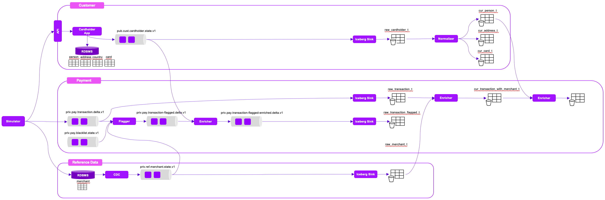
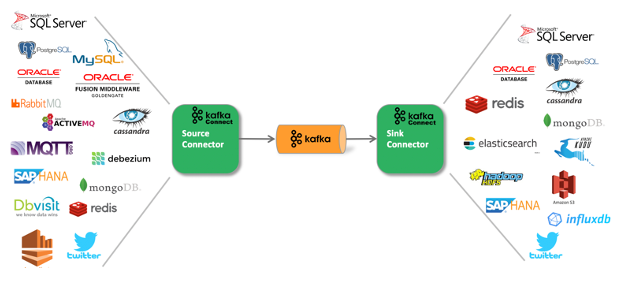
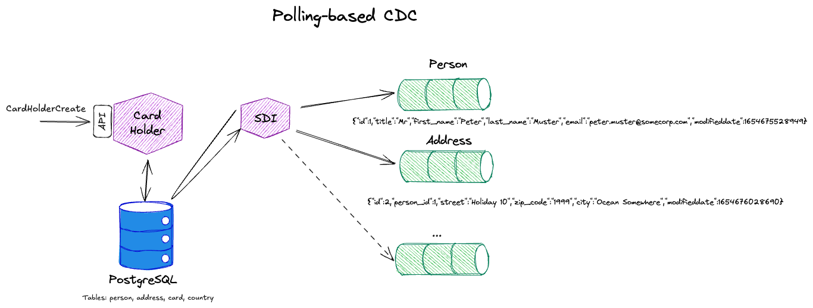
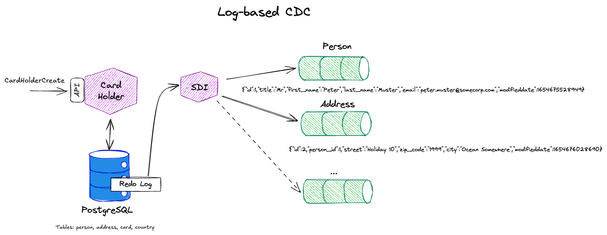
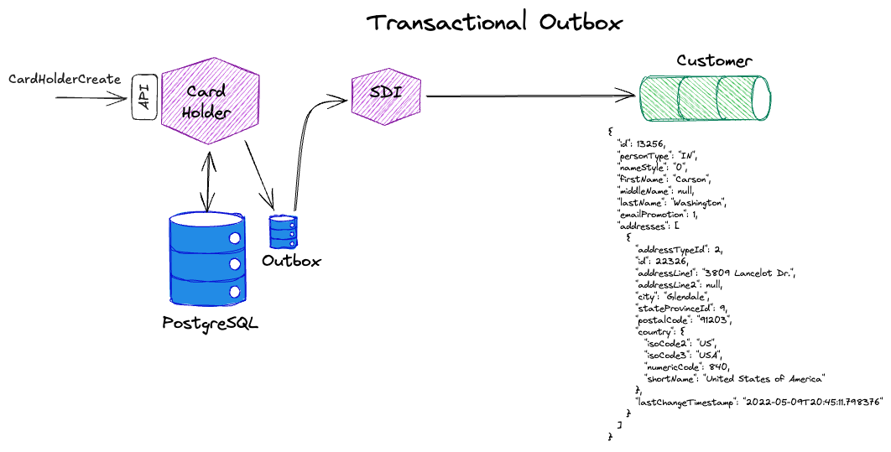
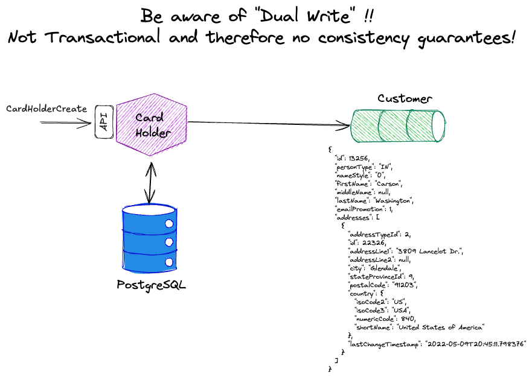
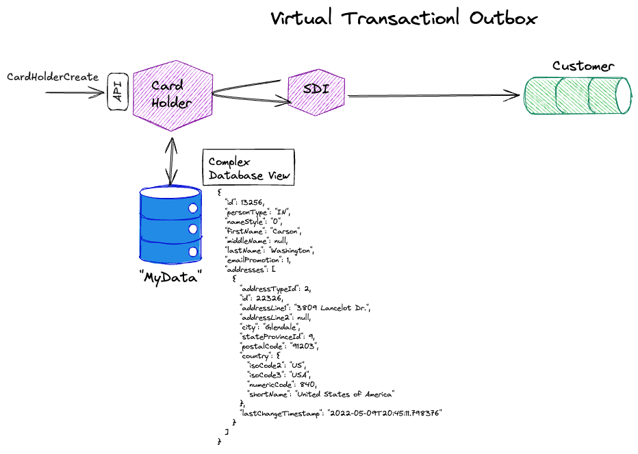
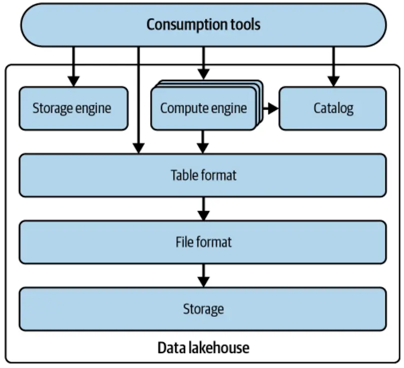
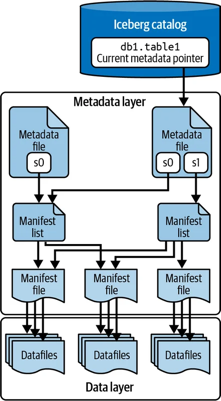

# Credit Card Fraud End-to-End Streaming Demo




This demo walks through an end-to-end credit card fraud detection pipeline built on Apache Kafka and Apache Iceberg. Synthetic transaction and cardholder data is generated by [ShadowTraffic](https://shadowtraffic.io/), streamed through Kafka, enriched and flagged for fraud using ksqlDB, persisted to Iceberg tables on RustFS via Kafka Connect, and finally queried via Trino.

The data flow covers three entity domains:
- **Transactions** (`priv.pay.transaction.delta.v1`) — the primary stream, flagged against a merchant blacklist and enriched with merchant/cardholder context
- **Card Holders** (`pub.cus.cardHolder.state.v1`) — onboarded via the `lhbank-cardholder` Spring Boot service using the transactional outbox pattern
- **Reference data** — merchants (`pub.ref.merchant.state.v1`) and city geolocations (`priv.ref.geonames.state.v1`)

The platform for this demo has been created using the [Platys - Platform in a box](http://github.com/trivadispf/platys) toolkit.

## Prerequisites

- Docker and Docker Compose (16 - 32 GB RAM allocated to Docker recommended)
- `dataplatform` added to `/etc/hosts` pointing to `127.0.0.1`
- Java 21 and Maven (only needed for the `lhbank-cardholder` service)
- Get a license for [ShadowTraffic](https://shadowtraffic.io/) - there is a free trial version available
- Run `./deploy.sh` once before starting to download the Iceberg Kafka Connect plugin and set up the truststore

## 00 - Starting the Platform

**Goal:** Get all platform services running and synthetic data flowing into Kafka so the rest of the demo has live data to work with.

### Make shadowtraffic license available

ShadowTraffic requires a license to run. Set the following environment variables with the values from your license file before starting the stack:

```bash
export PLATYS_SHADOW_TRAFFIC_LICENSE_ID=
export PLATYS_SHADOW_TRAFFIC_LICENSE_EMAIL=
export PLATYS_SHADOW_TRAFFIC_LICENSE_ORGANIZATION=
export PLATYS_SHADOW_TRAFFIC_LICENSE_EDITION=
export PLATYS_SHADOW_TRAFFIC_LICENSE_EXPIRATION=
export PLATYS_SHADOW_TRAFFIC_LICENSE_SIGNATURE=
```

### Start base services

Set environment variables and bring up the full stack. The platform includes Kafka (KRaft, 3 brokers), Schema Registry, ksqlDB, Kafka Connect, Spark, Hive Metastore, RustFS, PostgreSQL, and Trino.

```bash
export PUBLIC_IP=127.0.0.1
export DOCKER_HOST_IP=localhost
export DATAPLATFORM_IP=localhost

docker compose up -d

sudo chmod 777 container-volume/spark/logs
```

Wait for all services to be healthy before proceeding (typically 1–2 minutes).

> **What you should see:** `docker compose ps` should show all containers in a `running` or `healthy` state. If any container is in a restart loop, check its logs with `docker compose logs <service-name>`.

### Start simulator

Traffic is generated using [ShadowTraffic](https://shadowtraffic.io/), which reads `scripts/shadowtraffic/card-fraud.json` and produces synthetic cardholders and transactions to Kafka. Start it once the base stack is running.

```bash
docker compose --profile test up -d
```

This will begin populating `priv.pay.transaction.delta.v1` and `pub.ref.merchant.state.v1` with synthetic data.

> **What just happened?** ShadowTraffic reads the generator config in `scripts/shadowtraffic/card-fraud.json` and continuously produces realistic synthetic credit card transactions and merchant records to Kafka. Transactions include randomized card numbers, amounts, merchant IDs, channels, and dates. Merchant records include names, categories, cities, and countries.

## 01 - CardHolder Application (OLTP)

**Goal:** Understand the structure of the source OLTP database that the `lhbank-cardholder` Spring Boot service writes to. This gives you a baseline understanding of what data will later be streamed into Kafka.

The `lhbank-cardholder` service stores its data in a PostgreSQL database called `customer_db`. Before streaming this data anywhere, it helps to inspect the table structure directly. Run the following commands to explore the database schema and sample data:

List all tables in the `customer_db` database:

```bash
docker exec -ti postgresql psql -d customer_db -U customer -c "\dt"
```

> **What you should see:** A list of tables including `person`, `address`, `country`, `card`, and `outbox`. The `outbox` table is the key table used by the transactional outbox pattern (covered in section 02).

Preview the `person` and `address` tables:

```bash
docker exec -ti postgresql psql -d customer_db -U customer -c "SELECT * FROM person LIMIT 10;"
```

```bash
docker exec -ti postgresql psql -d customer_db -U customer -c "SELECT * FROM address LIMIT 10;"
```

To explore the table schemas interactively, connect to the `psql` shell:

```bash
docker exec -ti postgresql psql -d customer_db -U customer
```

Once connected, describe the `person` table to understand its columns:

```sql
\d person
```

Describe the `address` table:

```sql
\d address
```

> **What just happened?** You have confirmed that the source OLTP database is running and contains cardholder data. The `person` and `address` tables hold the core business data, while the `outbox` table (visible in `\dt`) will be used by Debezium in section 02 to propagate changes to Kafka without dual writes.

## 02 - Stream Enabling the CardHolder Application

**Goal:** Capture cardholder data changes from PostgreSQL into Kafka topics using Kafka Connect. You will compare three CDC approaches — polling, log-based, and the transactional outbox pattern — and understand when to use each.

This section demonstrates three approaches to capturing cardholder data changes from PostgreSQL into Kafka, each with different trade-offs. We will use various Kafka Connect connectors. 

### What is Kafka Connect



Kafka Connect is a framework for scalable and reliable data streaming between Kafka and other systems. It uses connector plugins — each connector handles the specifics of reading from or writing to a particular system. Before setting up any connectors, you can list the available connector plugins to confirm that the JDBC and Debezium connectors are installed:

```
curl -X "GET" "$DOCKER_HOST_IP:8083/connector-plugins" | jq
```

> **What you should see:** A JSON array of connector plugin objects. Look for entries containing `JdbcSourceConnector` and `PostgresConnector` — these are the connectors used in this section.

* Kafka Connect UI: <http://dataplatform:28103>


### Polling-based CDC using Kafka Connect JDBC Connector

Polling-based CDC periodically queries the source tables using a watermark column (`modified_at`). It is simple to set up but introduces latency proportional to the poll interval and cannot capture deletes.



First, create the target Kafka topics that the JDBC connector will write to:

```bash
docker exec -ti kafka-1 kafka-topics --bootstrap-server kafka-1:19092 --create --topic priv.cus.person.cdc.v1 --partitions 2 --replication-factor 3

docker exec -ti kafka-1 kafka-topics --bootstrap-server kafka-1:19092 --create --topic priv.cus.address.cdc.v1 --partitions 2 --replication-factor 3

docker exec -ti kafka-1 kafka-topics --bootstrap-server kafka-1:19092 --create --topic priv.cus.country.cdc.v1 --partitions 2 --replication-factor 3

docker exec -ti kafka-1 kafka-topics --bootstrap-server kafka-1:19092 --create --topic priv.cus.card.cdc.v1 --partitions 2 --replication-factor 3
```

Now register the JDBC source connector. It polls all four tables every 10 seconds using the `modified_at` timestamp column as a watermark:

```bash
curl -X "POST" "$DATAPLATFORM_IP:8083/connectors" \
     -H "Content-Type: application/json" \
     -d '{
  "name": "customer.jdbcsrc.query-based-cdc",
  "config": {
    "connector.class": "io.confluent.connect.jdbc.JdbcSourceConnector",
    "name": "customer.jdbcsrc.query-based-cdc",
    "tasks.max": "1",
    "connection.url": "jdbc:postgresql://postgresql/customer_db?user=customer&password=abc123!",
    "mode": "timestamp",
    "timestamp.column.name": "modified_at",
    "poll.interval.ms": "10000",
    "table.whitelist": "public.person, public.address, public.country, public.card",
    "validate.non.null": "false",
    "topic.prefix": "priv.cus.",
    "key.converter": "org.apache.kafka.connect.storage.StringConverter",
    "key.converter.schemas.enable": "false",
    "value.converter": "io.confluent.connect.avro.AvroConverter",
    "value.converter.schema.registry.url": "http://schema-registry-1:8081",    
    "transforms": "createKey,extractInt,addSuffix",
    "transforms.createKey.type": "org.apache.kafka.connect.transforms.ValueToKey",
    "transforms.createKey.fields": "id",
    "transforms.extractInt.type": "org.apache.kafka.connect.transforms.ExtractField$Key",
    "transforms.extractInt.field": "id",
    "transforms.addSuffix.type": "org.apache.kafka.connect.transforms.RegexRouter",
    "transforms.addSuffix.regex": ".*",
    "transforms.addSuffix.replacement": "$0.cdc.v1"
  }
}'
```

Verify that person records are flowing into Kafka:

```bash
kcat -b localhost -t priv.cus.person.cdc.v1 -q -r http://dataplatform:8081 -s value=avro
```

> **What you should see:** A stream of Avro-encoded person records printed to the terminal. Each record corresponds to a row from the `person` table. Press `Ctrl+C` to stop.

### Log-based CDC using Debezium and Kafka Connect

Log-based CDC reads directly from the PostgreSQL write-ahead log (WAL) via the `pgoutput` plugin. This captures all changes (inserts, updates, and deletes) with near-zero latency and no impact on the source database's query load.



Register the Debezium PostgreSQL connector for log-based CDC. Unlike the JDBC connector above, this connector tails the WAL and does not need a watermark column — it captures every row-level change in real time:

```
curl -X PUT \
  "http://$DATAPLATFORM_IP:8083/connectors/customer.dbzsrc.log-based-cdc/config" \
  -H 'Content-Type: application/json' \
  -H 'Accept: application/json' \
  -d '{
  "connector.class": "io.debezium.connector.postgresql.PostgresConnector",
  "tasks.max": "1",
  "slot.name":"dbzlogbased",
  "database.server.name": "postgresql",
  "database.port": "5432",
  "database.user": "customer",
  "database.password": "abc123!",  
  "database.dbname": "customer_db",
  "schema.include.list": "public",
  "table.include.list": "public.person, public.address, public.card, public.country",
  "plugin.name": "pgoutput",
  "topic.prefix": "customer",  
  "tombstones.on.delete": "false",
  "database.hostname": "postgresql",
  "transforms":"dropPrefix",  
  "transforms.dropPrefix.type": "org.apache.kafka.connect.transforms.RegexRouter",  
  "transforms.dropPrefix.regex": "customer.public.(.*)",  
  "transforms.dropPrefix.replacement": "priv.$1.dbz.v1",
  "topic.creation.default.replication.factor": 3,
  "topic.creation.default.partitions": 2,
  "topic.creation.default.cleanup.policy": "compact"
}'
```

Verify that person change events are flowing from the WAL:

```
kcat -b localhost -t priv.person.dbz.v1 -r http://localhost:8081 -s value=avro -o end -q
```

> **What you should see:** Debezium change event envelopes containing `before`, `after`, and `op` (operation) fields. The `op` field will be `c` for inserts, `u` for updates, and `d` for deletes. This is richer than the JDBC connector output, which only carries the current row state.

### Transactional Outbox Pattern using Debezium and Kafka Connect

The transactional outbox pattern is used by the `lhbank-cardholder` Spring Boot service. When a cardholder is onboarded, the service writes to both the business tables and an `outbox` table in the same database transaction — guaranteeing atomicity without a distributed transaction. Debezium then captures the outbox inserts via CDC and routes events to Kafka topics based on the `event_type` column using the `EventRouter` Single Message Transform. This is the recommended approach for the main cardholder integration.



First start the `lhbank-cardholder` service (or use the Docker Compose override), then register the connector:

```
curl -X PUT \
  "http://$DATAPLATFORM_IP:8083/connectors/cardHolder.dbzsrc.outbox/config" \
  -H 'Content-Type: application/json' \
  -H 'Accept: application/json' \
  -d '{
  "connector.class": "io.debezium.connector.postgresql.PostgresConnector",
  "tasks.max": "1",
  "slot.name":"dbzoutbox",  
  "database.server.name": "postgresql",
  "database.port": "5432",
  "database.user": "customer",
  "database.password": "abc123!",
  "database.dbname": "customer_db",
  "topic.prefix": "cardHolder",
  "schema.include.list": "public",
  "table.include.list": "public.outbox",
  "plugin.name": "pgoutput",
  "publication.name":"dbzoutbox",
  "slot.name":"debezium",
  "tombstones.on.delete": "false",
  "database.hostname": "postgresql",
  "transforms": "outbox",
  "transforms.outbox.type": "io.debezium.transforms.outbox.EventRouter",
  "transforms.outbox.table.field.event.id": "id",
  "transforms.outbox.table.field.event.key": "event_key",
  "transforms.outbox.table.field.event.payload": "payload_avro",
  "transforms.outbox.route.by.field": "event_type",
  "transforms.outbox.route.topic.replacement": "pub.cus.${routedByValue}.state.v1",
  "value.converter": "io.debezium.converters.BinaryDataConverter",
  "topic.creation.default.replication.factor": 3,
  "topic.creation.default.partitions": 8,
  "key.converter": "org.apache.kafka.connect.storage.StringConverter"
}'
```

Confirm that cardholder events are being routed to the correct topic:

```
kcat -b dataplatform -t pub.cus.cardHolder.state.v1 -r http://dataplatform:8081 -s value=avro -o end -q
```

> **What just happened?** The `EventRouter` SMT reads the `event_type` column from each outbox row and routes the payload to the topic `pub.cus.${routedByValue}.state.v1`. For cardholder events the topic becomes `pub.cus.cardHolder.state.v1`. The Avro payload stored in `payload_avro` is passed through as the Kafka message value, preserving the full schema.

### Why not sending directly to Kafka?

Writing to both the database and Kafka directly (dual write) is not safe: if the Kafka write succeeds but the database write fails (or vice versa), the two systems become inconsistent. The transactional outbox pattern avoids this by making the outbox write part of the same database transaction as the business write.



### Virtual Outbox using View and database object-relational/json features

An alternative to a physical outbox table is a virtual outbox implemented as a database view that projects the business tables into the same event structure. This avoids the overhead of writing to an extra table but still relies on log-based CDC to capture changes.



## 03 Payment App - Credit Card Transaction Stream

**Goal:** Confirm that the synthetic transaction stream is flowing through Kafka and learn how to inspect it using command-line tools and the AKHQ UI.

Credit Card Transaction arrive as a real-time data stream / events. We can easily view the stream by using the following command:

```bash
kcat -b dataplatform -t priv.pay.transaction.delta.v1 -q -r http://dataplatform:8081 -s value=avro
```

> **What you should see:** A continuous stream of Avro-decoded transaction records, one per line, flowing to the terminal. Each record contains fields like `transaction_id`, `card_number`, `amount`, `merchant_id`, `channel`, and `transaction_date`. Press `Ctrl+C` to stop consuming. If nothing appears, confirm that the ShadowTraffic simulator from section 00 is still running.

Navigate to AKHQ: <http://dataplatform:28107> to view the `priv.pay.transaction.delta.v1` topic.

## 04 - Merchant Data

**Goal:** Confirm that merchant reference data is available as a Kafka topic and understand its role in later enrichment steps.

Merchant data is directly made available as a state topic in Kafka. The `pub.ref.merchant.state.v1` topic is a compacted topic (meaning Kafka retains only the latest value per key), which makes it ideal for use as a lookup table in ksqlDB stream-table joins. Each record represents a merchant and includes fields such as `merchant_id`, `name`, `country`, `city`, and `category_name`. These fields will be joined onto transaction records in section 06 to add context to flagged transactions.

Navigate to AKHQ: <http://dataplatform:28107> to view the `pub.ref.merchant.state.v1` topic.

> **What you should see:** Individual merchant records in the topic, each keyed by `merchant_id`. The compacted retention policy means that for any given merchant, only the most recent record is kept — equivalent to a key-value store. Confirm that the topic has records before proceeding to section 06.

## 05 - Provide Geonames data

**Goal:** Load city geolocation data into Kafka so that transaction city names can be enriched with latitude/longitude coordinates in section 06.

This section loads the [GeoNames](https://www.geonames.org/) `cities1000.txt` dataset — a tab-separated file of all cities with a population over 1,000 — into the `priv.ref.geonames.state.v1` Kafka topic. The ksqlDB geo enrichment step in section 01 reads this topic to attach latitude/longitude coordinates to transaction city names.

The notebook for this step is `jupyter/10-cities-for-geo-location.ipynb`.

First upload `data/cities1000.txt` to `s3a://landing-bucket/geonames` in local RustFS, then run the following Spark session to read the file and write it to Kafka. Open Jupyter at <http://dataplatform:28888> and create a notebook with the **Python 3.12.8** kernel.

Start a Spark session configured to talk to both RustFS (for reading the GeoNames file) and the Iceberg REST catalog:

```python
import os
# get the accessKey and secretKey from Environment
accessKey = os.environ['AWS_ACCESS_KEY_ID']
secretKey = os.environ['AWS_SECRET_ACCESS_KEY']

from pyspark.sql import SparkSession
spark = (
    SparkSession.builder
        .appName("Jupyter")
        .master("spark://spark-master:7077")

        .config("spark.jars.packages",
                "org.apache.iceberg:iceberg-spark-runtime-3.5_2.12:1.10.1,"
                "org.apache.iceberg:iceberg-aws-bundle:1.10.1")

        .config("spark.hadoop.fs.s3a.impl", "org.apache.hadoop.fs.s3a.S3AFileSystem")
        .config("spark.hadoop.fs.s3a.endpoint", "http://rustfs-1:9000")
        .config("spark.hadoop.fs.s3a.path.style.access", "true")
        .config("spark.hadoop.fs.s3a.access.key", accessKey)
        .config("spark.hadoop.fs.s3a.secret.key", secretKey)
        .config("spark.hadoop.fs.s3a.aws.credentials.provider", "org.apache.hadoop.fs.s3a.SimpleAWSCredentialsProvider")

        # ==== Iceberg catalog (Hive Metastore Iceberg REST Catalog) ===
        .config("spark.sql.catalog.hive_iceberg_rest", "org.apache.iceberg.spark.SparkCatalog")
        .config("spark.sql.catalog.hive_iceberg_rest.type", "rest")
        .config("spark.sql.catalog.hive_iceberg_rest.uri", "http://hive-metastore:9084/iceberg")
        .config("spark.sql.catalog.hive_iceberg_rest.warehouse", "s3a://admin-bucket/iceberg/warehouse")
        .config("spark.sql.catalog.hive_iceberg_rest.io-impl", "org.apache.iceberg.aws.s3.S3FileIO")
        .config("spark.sql.catalog.hive_iceberg_rest.s3.endpoint", "http://rustfs-1:9000")
        .config("spark.sql.catalog.hive_iceberg_rest.s3.access-key-id", accessKey)
        .config("spark.sql.catalog.hive_iceberg_rest.s3.secret-access-key", secretKey)
        .config("spark.sql.catalog.hive_iceberg_rest.s3.path-style-access", "true")
    
        # use "hive_iceberg" as the default catalog
        .config("spark.sql.defaultCatalog", "hive_iceberg_rest")

        .config(
            "spark.sql.extensions",
            "org.apache.iceberg.spark.extensions.IcebergSparkSessionExtensions"
        )

        .getOrCreate()
)
```

Read the GeoNames TSV file from RustFS, applying the full 19-column schema:

```python
from pyspark.sql.types import *

schema = StructType([
    StructField("geonameid", LongType()),
    StructField("name", StringType()),
    StructField("asciiname", StringType()),
    StructField("alternatenames", StringType()),
    StructField("latitude", DoubleType()),
    StructField("longitude", DoubleType()),
    StructField("feature_class", StringType()),
    StructField("feature_code", StringType()),
    StructField("country_code", StringType()),
    StructField("cc2", StringType()),
    StructField("admin1_code", StringType()),
    StructField("admin2_code", StringType()),
    StructField("admin3_code", StringType()),
    StructField("admin4_code", StringType()),
    StructField("population", LongType()),
    StructField("elevation", IntegerType()),
    StructField("dem", IntegerType()),
    StructField("timezone", StringType()),
    StructField("modification_date", StringType())
])

df = (
    spark.read
        .option("sep", "\t")
        .schema(schema)
        .csv("s3a://landing-bucket/geonames/cities1000.txt")
)
```

Now project down to just the fields needed for geo enrichment (`name`, `latitude`, `longitude`) and write them as JSON messages to the `priv.ref.geonames.state.v1` Kafka topic. The city name becomes the Kafka message key (used for partitioning and table lookups), and the JSON struct becomes the value:

```python
from pyspark.sql.functions import to_json, struct, col

# Select only the required fields and convert to JSON
kafka_df = df.select(
    to_json(
        struct(
            col("name"),
            col("latitude"),
            col("longitude")
        )
    ).alias("value")  # Kafka expects a column named 'value' for the message payload
)

# Write to Kafka
kafka_df.write \
    .format("kafka") \
    .option("kafka.bootstrap.servers", "kafka-1:19092") \
    .option("topic", "priv.ref.geonames.state.v1") \
    .save()
```

> **What just happened?** Spark read roughly 150,000 city records from the GeoNames file in RustFS and wrote each one as a JSON message to Kafka. The `priv.ref.geonames.state.v1` topic now acts as a reference lookup table that ksqlDB can join against in the geo enrichment step in section 06.

## 06 - Fraud Detection on Credit Card Transaction Stream

**Goal:** Build a multi-stage streaming fraud detection pipeline in ksqlDB that progressively enriches and scores each transaction. By the end of this section, every transaction flowing through Kafka will carry a fraud flag and a reason code.

This section uses ksqlDB to build a streaming fraud detection pipeline on top of the raw transaction data. The pipeline progressively enriches and flags transactions:

1. Create a stream over the raw transaction topic
2. Join with a merchant blacklist table to flag known-bad merchants
3. Enrich flagged transactions with merchant details (name, country, city, category)
4. Further enrich with cardholder profile data to flag transactions exceeding the cardholder's personal average amount
5. Add geo-coordinates to city names for downstream analytics

Connect to the ksqlDB CLI to run the statements below:

``` bash
docker exec -it ksqldb-cli ksql http://ksqldb-server-1:8088
```

### Prepare KSQL Stream `pay_transaction_s` and perform a streaming query

**Goal:** Map the raw Kafka topic to a typed ksqlDB stream so you can run SQL queries against it.

Create a stream that reads from the raw transaction topic. Transactions are serialized with Avro and the schema is managed by Schema Registry.

``` sql
CREATE STREAM IF NOT EXISTS pay_transaction_s 
  WITH (kafka_topic='priv.pay.transaction.delta.v1',
        value_format='AVRO');
```

> **What just happened?** ksqlDB has created a logical stream on top of the Kafka topic. No data was moved — the stream is a live, continuously updated view of the topic. From this point forward you can query the stream using familiar SQL syntax.

Run a push query to see transactions arriving in real time:

```sql
SELECT * FROM pay_transaction_s EMIT CHANGES;
```

> **What you should see:** A continuous flow of transaction rows printed to the CLI. Each row represents one payment event. Press `Ctrl+C` to stop.

#### Perform a stateless streaming operation on `pay_transaction_s` (filter)

You can add a `WHERE` clause to any push query to filter the stream in real time. The following query shows only transactions for three specific merchants:

```sql
SELECT *
FROM pay_transaction_s 
WHERE merchant_id IN ('merchant-87', 'merchant-32', 'merchant-82')
EMIT CHANGES;
```

#### Perform statefull streaming operations on `pay_transaction_s` (aggregations)

ksqlDB can also maintain running aggregates over the stream. The following query counts transactions per card number, updating the count each time a new transaction arrives:

```sql
SELECT card_number, COUNT(*) AS nof 
FROM pay_transaction_s
GROUP BY card_number
EMIT CHANGES;
```

Windowed aggregations let you summarize over fixed time intervals. The following query counts and sums transactions per card number within rolling 1-minute tumbling windows:

```sql
SELECT
  TIMESTAMPTOSTRING(WINDOWSTART, 'yyyy-MM-dd HH:mm:ss', 'UTC') AS window_start,
  TIMESTAMPTOSTRING(WINDOWEND, 'yyyy-MM-dd HH:mm:ss', 'UTC') AS window_end,
  card_number,
  COUNT(*) AS nof,
  SUM(amount) AS sum
FROM pay_transaction_s
WINDOW TUMBLING (SIZE 1 MINUTE)
GROUP BY card_number
EMIT CHANGES;
```

To focus on cards with more than one transaction per minute — a potential velocity fraud signal — add a `HAVING` clause:

```sql
SELECT
  TIMESTAMPTOSTRING(WINDOWSTART, 'yyyy-MM-dd HH:mm:ss', 'UTC') AS window_start,
  TIMESTAMPTOSTRING(WINDOWEND, 'yyyy-MM-dd HH:mm:ss', 'UTC') AS window_end,
  card_number,
  COUNT(*) AS nof,
  SUM(amount) AS sum
FROM pay_transaction_s
WINDOW TUMBLING (SIZE 1 MINUTE)
GROUP BY card_number
HAVING COUNT(*) > 1
EMIT CHANGES;
```

### Prepare black list table and use it to flag problematic transactions

**Goal:** Create a dynamic blacklist of merchants and join it against the transaction stream so that any transaction involving a blacklisted merchant is flagged in real time.

The blacklist is a ksqlDB table backed by the compacted topic `priv.pay.blacklist.state.v1`. A table in ksqlDB represents the latest state per key, making it suitable for point-in-time lookups during stream-table joins.

```sql
CREATE TABLE IF NOT EXISTS pay_blacklist_t (key VARCHAR PRIMARY KEY, merchant_id VARCHAR)
WITH (kafka_topic='priv.pay.blacklist.state.v1',
        value_format='AVRO', key_format='AVRO');
```

Let's join the transaction stream with the blacklist table to see which transactions involve blacklisted merchants:

```sql
SELECT t.*
	, CASE 
			WHEN bl.key IS NOT NULL 
			THEN 1 else 0 
		END 					AS is_flagged
	, CASE 
			WHEN bl.key IS NOT NULL 
			THEN 'blacklist' else ''
		END 					AS flagged_reason		
FROM pay_transaction_s		t
LEFT JOIN pay_blacklist_t  bl
ON (t.merchant_id = bl.key)
EMIT CHANGES;
```

As the black list is currently empty, no transaction is flagged, which is of course ok!

In another terminal, insert two black-listed merchants into the black list table:

``` bash
docker exec -it ksqldb-cli ksql http://ksqldb-server-1:8088
```

```sql
INSERT INTO pay_blacklist_t (key, merchant_id)
VALUES ('merchant-199', 'merchant-199');

INSERT INTO pay_blacklist_t (key, merchant_id)
VALUES ('merchant-10', 'merchant-10');
```

> **What just happened?** Inserting these rows into `pay_blacklist_t` publishes messages to the `priv.pay.blacklist.state.v1` topic. ksqlDB immediately picks up the new entries and the running join query in the first terminal will now start emitting rows with `is_flagged = 1` for any transaction where `merchant_id` matches `merchant-199` or `merchant-10`.

You should now start to see some flagged transactions in the other window. As it is a bit hard to spot among the many non-problematic transactions, let's just select the ones where the flag is not `0`.

Stop the query.

Now that the blacklist join works interactively, materialize it into a persistent Kafka-backed stream so that other consumers can subscribe to flagged transactions downstream:

```
DROP STREAM IF EXISTS pay_transaction_flagged_enriched_s;
DROP STREAM IF EXISTS pay_transaction_flagged_s;

CREATE STREAM pay_transaction_flagged_s
  WITH (kafka_topic='priv.pay.transaction-flagged.delta.v1',
        value_format='AVRO', key_format='AVRO', partitions=2)
AS
	SELECT t.transaction_id
	, t.card_number
	, t.currency
	, t.amount
	, t.merchant_id        AS merchant_id
	, t.channel
	, t.transaction_date
	, CASE 
			WHEN bl.key IS NOT NULL 
			THEN 1 else 0 
		END 					AS is_flagged
	, CASE 
			WHEN bl.key IS NOT NULL 
			THEN 'blacklist' else ''
		END 					AS flagged_reason
	FROM pay_transaction_s		t
	LEFT JOIN pay_blacklist_t  bl
		ON (t.merchant_id = bl.key)
	EMIT CHANGES; 
```

> **What just happened?** ksqlDB created the stream `pay_transaction_flagged_s` and started a persistent query in the background. Every incoming transaction from `pay_transaction_s` is now joined against the blacklist and the result (with `is_flagged` and `flagged_reason`) is written to the new topic `priv.pay.transaction-flagged.delta.v1`. This topic serves as the input to the next enrichment stage.

Now let's only view the flagged transactions:

```sql
SELECT * 
FROM pay_transaction_flagged_s 
WHERE is_flagged = 1 
EMIT CHANGES;
```

> **What you should see:** Only rows where `is_flagged = 1` and `flagged_reason = 'blacklist'`. If you see no results, the blacklist merchants (`merchant-199`, `merchant-10`) may not have appeared in the synthetic data yet. You can add more merchants to the blacklist using additional `INSERT INTO pay_blacklist_t` statements.

if you think it takes to long, you can of course add other merchants to the blacklist. 

### Prepare table `ref_merchant_t` and join it to transactions

**Goal:** Enrich each flagged transaction with human-readable merchant details so that downstream analytics can identify not just the fraud flag but also where and in what category the suspicious transaction occurred.

Enriching transactions with merchant details (name, city, country, category) enables downstream analytics to understand where fraud is occurring. The merchant table is backed by the compacted `pub.ref.merchant.state.v1` topic populated by ShadowTraffic.

```sql
CREATE TABLE IF NOT EXISTS ref_merchant_t (key STRING PRIMARY KEY)
  WITH (kafka_topic='pub.ref.merchant.state.v1',
        value_format='AVRO', key_format='AVRO');
```

Preview the join interactively before materializing it:

```sql
SELECT t.*
		, m.name 				AS merchant_name
		, m.country
		, m.city
		, m.category_name
FROM pay_transaction_flagged_s		t
LEFT JOIN ref_merchant_t m
	ON (t.merchant_id = m.key)
EMIT CHANGES; 
```

> **What you should see:** Transaction rows now include `merchant_name`, `country`, `city`, and `category_name` alongside the flag fields. Rows where the merchant is not found in the reference table will have `null` for the merchant fields — this can happen for new merchants that haven't been loaded yet.

Now materialize the enriched result into a persistent stream:

```sql
DROP STREAM IF EXISTS pay_transaction_flagged_enriched_s;

CREATE STREAM pay_transaction_flagged_enriched_s
  WITH (kafka_topic='priv.pay.transaction-flagged-enriched.delta.v1',
        value_format='AVRO', key_format='AVRO', partitions=2)
AS
	SELECT t.transaction_id
		, t.card_number
		, t.currency
		, t.amount
		, t.channel
		, t.transaction_date
		, t.is_flagged
		, t.flagged_reason
		, t.merchant_id		AS merchant_id
		, m.name 				AS merchant_name
		, m.country
		, m.city
		, m.category_name
	FROM pay_transaction_flagged_s		t
	LEFT JOIN ref_merchant_t m
		ON (t.merchant_id = m.key)
	EMIT CHANGES; 
```

Verify all enriched transactions are flowing:

```sql
SELECT * 
FROM pay_transaction_flagged_enriched_s
EMIT CHANGES;
```

Filter to only flagged transactions to confirm the enrichment is working end to end:

```sql
SELECT * 
FROM pay_transaction_flagged_enriched_s
WHERE is_flagged = 1 
EMIT CHANGES;
```

### Unusually large transactions (optional, if `pub.cus.cardHolder.state.v1` topic available)

**Goal:** Add a second fraud signal — personalised high-amount detection — by comparing each transaction against the cardholder's own historical average transaction amount.

This step adds personalized fraud scoring: instead of a fixed threshold, each transaction is compared against the cardholder's own `avg_transaction_amount`. This requires the cardholder data to be flowing (see section 07). Ensure that the `pub.cus.cardHolder.state.v1` topic is populated (via the outbox connector registered in section 02) before proceeding.

First we re-partition the cardholder stream by card number so it can be joined with the transaction stream:

```sql
	SELECT t.transaction_id
		, t.card_number
		, t.currency
		, t.amount
		, t.channel
		, t.transaction_date
		, CASE WHEN (t.amount > 200) 
				THEN t.is_flagged + 1 
				ELSE t.is_flagged 
		  END AS is_flagged
		, CASE WHEN (t.amount > 200) 
				THEN CONCAT(t.flagged_reason, ',', 'high-amount')
				ELSE t.flagged_reason
		  END AS flagged_reason
		, t.merchant_id		AS merchant_id
		, t.merchant_name
		, t.country
		, t.city
		, t.category_name
	FROM pay_transaction_flagged_enriched_s  t
	PARTITION BY t.card_number
	EMIT CHANGES; 
```

```sql
CREATE STREAM IF NOT EXISTS cus_cardholder_s
WITH (kafka_topic='pub.cus.cardHolder.state.v1',
        value_format='AVRO');
```


```sql
CREATE STREAM IF NOT EXISTS cus_cardholder_by_card_number_s
AS
SELECT * FROM cus_cardholder_s c
PARTITION BY c.card_holder->card->number
EMIT CHANGES; 
```

```sql
CREATE TABLE IF NOT EXISTS cus_cardholder_t (key VARCHAR PRIMARY KEY)
WITH (kafka_topic='CUS_CARDHOLDER_BY_CARD_NUMBER_S',
        value_format='AVRO');
```

> **What just happened?** ksqlDB stream-table joins require both sides to be co-partitioned by the join key. The original cardholder topic is partitioned by cardholder ID, but the transactions use `card_number` as the join key. By creating `cus_cardholder_by_card_number_s` (repartitioned by card number) and then creating `cus_cardholder_t` on top of it, the two streams are now aligned and can be joined correctly.

Now create the persistent enriched stream that uses the cardholder's personal average to detect unusually large transactions:

```sql
CREATE STREAM pay_transaction_flagged2_enriched_s
  WITH (kafka_topic='priv.pay.transaction-flagged2-enriched.delta.v1',
        value_format='AVRO', key_format='AVRO', partitions=2)
AS
	SELECT t.transaction_id
		, t.card_number
		, t.currency
		, t.amount
		, t.channel
		, t.transaction_date
		, CASE WHEN (t.amount > card_holder->avg_transaction_amount) 
				THEN t.is_flagged + 1 
				ELSE t.is_flagged 
		  END AS is_flagged
		, CASE WHEN (t.amount > card_holder->avg_transaction_amount) 
				THEN CONCAT(t.flagged_reason
								, CASE WHEN t.flagged_reason IS NOT NULL and t.flagged_reason != '' THEN ',' ELSE '' END
								, 'high-amount')
				ELSE t.flagged_reason
		  END AS flagged_reason
		, t.merchant_id		AS merchant_id
		, t.merchant_name
		, t.country
		, t.city
		, t.category_name
		, c.card_holder->avg_transaction_amount
	FROM pay_transaction_flagged_enriched_s  t
	LEFT JOIN cus_cardholder_t c
		ON (t.card_number = c.key)
	PARTITION BY t.card_number
	EMIT CHANGES; 
```

Query the result to see transactions flagged for exceeding the cardholder's personal average:

```sql
SELECT * FROM pay_transaction_flagged2_enriched_s
WHERE is_flagged > 0
EMIT CHANGES;
```

> **What you should see:** Rows where `is_flagged` is `1` (blacklist only), `2` (blacklist + high amount), or `1` (high amount only). The `flagged_reason` column will contain a comma-separated list of reasons such as `blacklist,high-amount`.

### Geo Enrichment (opitonal, if `pub.ref.geonames.state.v1` topic available)

**Goal:** Add latitude and longitude coordinates to the enriched transaction stream so that downstream analytics tools can plot transactions on a map.

City names in the transaction data are matched against the GeoNames dataset (loaded in section 10) to attach latitude/longitude coordinates. Because ksqlDB stream-table joins require co-partitioning, we first re-partition the enriched transaction stream by `city` before joining. This step requires that section 05 (GeoNames data load) has been completed successfully.

```sql
CREATE TABLE IF NOT EXISTS ref_geonames_t (key VARCHAR PRIMARY KEY, name VARCHAR, latitude DOUBLE, longitude DOUBLE)
WITH (kafka_topic='priv.ref.geonames.state.v1',
        value_format='JSON');
```

Test the join interactively before persisting it:

```sql
SELECT *
FROM pay_transaction_flagged_enriched_s t
LEFT JOIN ref_geonames_t g
  ON t.city = g.key
EMIT CHANGES;
```

> **What you should see:** Transaction rows now include `latitude` and `longitude` fields for each city. Cities that are not found in the GeoNames dataset will have `null` coordinates.

Because the GeoNames table has a single partition, re-partition the transaction stream to a single partition as well, using `city` as the new key:

```sql
DROP STREAM pay_transaction_flagged_enriched_s_p1;

CREATE STREAM pay_transaction_flagged_enriched_s_p1
WITH (kafka_topic='priv.pay.transaction_flagged_enriched_part1.state.v1', partitions=1) AS
SELECT *
FROM pay_transaction_flagged_enriched_s
PARTITION BY city
EMIT CHANGES;
```

Now join the repartitioned stream against the GeoNames table:

```sql
SELECT *
FROM pay_transaction_flagged_enriched_s_p1 t
LEFT JOIN ref_geonames_t g
  ON t.city = g.key
EMIT CHANGES;
```

## 07 - Write Kafka data as Iceberg tables to S3 Object Storage using Kafka Connect

**Goal:** Persistently land all streaming data — raw transactions, flagged transactions, merchant reference data, and cardholder events — into durable Iceberg tables on object storage. This makes the data available for batch analytics with Spark and Trino even after the Kafka topic retention window has passed.

Kafka Connect's [Apache Iceberg Sink Connector](https://iceberg.apache.org/docs/nightly/kafka-connect/) continuously reads from Kafka topics and writes data as Iceberg tables to object storage (RustFS locally, or IBM WatsonX.data). This gives us durable, queryable storage with schema evolution, time travel, and partition pruning — without a running Spark job.

#### What is Iceberg Table Format?

What is file format? and what is a table format?



We are using [Apache Iceberg](https://iceberg.apache.org/) table format in this demo. Data is written as Parquet files and the table metadata (schema, partition specs, snapshots) is tracked via the Hive Metastore Iceberg REST API.



For the Iceberg catalog, the local platform is using a Hive Meta Store 4.x configured with Iceberg REST API


#### S3 

For S3 Object Stroage, we are using a software-defined solution called RustFS which runs as part of the stack. 

Navigate to <http://dataplatform:9005> and login as

	* User: `admin`
   * Password: `abc123abc123!`

Check that there is already a bucket name `iceberg-bucket`. 

You can create buckets using the `rustfs-mc` CLI

```bash
docker exec -ti rustfs-mc mc mb rustfs-1/iceberg-bucket
```

#### Using Kafka Connect with the Iceberg connector

Before we can use the Kafka Connect [Iceberg Connector](https://iceberg.apache.org/docs/nightly/kafka-connect/), we first have to create the `control-iceberg` control topic. The Iceberg connector uses this topic internally to coordinate commits across connector tasks.

```bash
docker exec -it kafka-1 kafka-topics --bootstrap-server kafka-1:19092 --create --topic control-iceberg --partitions 1 --replication-factor 3
```

### Transaction data

Now that the infrastructure is in place, create the Iceberg tables and register the Kafka Connect sink connectors that will continuously populate them.

#### Create and write to `payment_db.raw_transaction_t`

First let's create the Iceberg table using Spark SQL. The table is partitioned by hour of `transaction_date` so that Trino and Spark can efficiently prune partitions when querying specific time ranges:

```bash
docker exec -ti spark-master spark-sql
```

```sql
use hive_iceberg_rest;

CREATE DATABASE payment_db
LOCATION 's3a://iceberg-bucket/payment_db';

CREATE TABLE payment_db.raw_transaction_t (
    transaction_id STRING,
    card_number STRING,
    currency STRING,
    amount DOUBLE,
    merchant_id STRING,
    channel STRING,
    transaction_date TIMESTAMP)
PARTITIONED BY (hours(transaction_date));
```

> **What just happened?** Spark created the Iceberg table definition in the Hive Metastore. The table metadata (schema, partition spec) is stored in the metastore, but no data files exist yet in RustFS. The Kafka Connect connector registered next will create those files.

Ingest data from Kafka topic `payment_db.raw_transaction_t` into the Iceberg table:

```bash
curl -X PUT \
  http://$DATAPLATFORM_IP:8083/connectors/pay-transaction-kafka-to-s3/config \
  -H 'Content-Type: application/json' \
  -H 'Accept: application/json' \
  -d '{
      "connector.class": "org.apache.iceberg.connect.IcebergSinkConnector",
      "tasks.max": "1",
      "topics": "priv.pay.transaction.delta.v1",
      "iceberg.tables": "payment_db.raw_transaction_t",
      "iceberg.tables.dynamic-enabled": "false",
      "write.upsert.enabled": "false",
      "iceberg.control.commit.interval-ms": "60000",
      "consumer.max.poll.records": "5000",
      "iceberg.catalog.type": "rest",
      "iceberg.catalog.uri": "http://hive-metastore:9084/iceberg",
      "iceberg.catalog.warehouse": "s3a://iceberg-bucket/payment_db",      
      "iceberg.catalog.client.region": "us-east-1",
      "iceberg.catalog.s3.endpoint": "http://rustfs-1:9000",
      "iceberg.catalog.s3.path-style-access": "true",
      "iceberg.catalog.s3.access-key-id": "admin",
      "iceberg.catalog.s3.secret-access-key": "abc123abc123!",
      "value.converter": "io.confluent.connect.avro.AvroConverter",
      "value.converter.schema.registry.url": "http://schema-registry-1:8081",
      "key.converter": "org.apache.kafka.connect.storage.StringConverter"
	}'
```

> **What just happened?** Kafka Connect registered a sink connector that continuously reads from `priv.pay.transaction.delta.v1` and commits batches to the Iceberg table every 60 seconds (`iceberg.control.commit.interval-ms`). Data will begin appearing in RustFS within the first minute.

#### Create and write to `payment_db.raw_transaction_flagged_t`

This table captures the output of the ksqlDB blacklist-join stream from section 06. It includes the `is_flagged` and `flagged_reason` columns that let analysts query only suspicious transactions.

First let's create the Iceberg table using Spark SQL:

```bash
docker exec -ti spark-master spark-sql
```

```sql
# `hive_iceberg_rest` represents the Hive Metastore Iceberg Rest Catalog
use hive_iceberg_rest;

DROP TABLE IF EXISTS payment_db.raw_transaction_flagged_t;

CREATE TABLE payment_db.raw_transaction_flagged_t (
    transaction_id STRING,
    card_number STRING,
    currency STRING,
    amount DOUBLE,
    channel STRING,
    transaction_date TIMESTAMP,
    is_flagged INTEGER,
    flagged_reason STRING)
PARTITIONED BY (hours(transaction_date));
```

Ingest data from Kafka topic `payment_db.raw_transaction_flagged_t` into the Iceberg table. We have to replace all column names by lower case, to match the format of the columns in the table.
 
```bash
curl -X PUT \
  http://$DATAPLATFORM_IP:8083/connectors/pay-transaction-flagged-enriched-kafka-to-s3/config \
  -H 'Content-Type: application/json' \
  -H 'Accept: application/json' \
  -d '{
      "connector.class": "org.apache.iceberg.connect.IcebergSinkConnector",
      "tasks.max": "1",
      "topics": "priv.pay.transaction-flagged.delta.v1",
      "iceberg.tables": "payment_db.raw_transaction_flagged_t",
      "iceberg.tables.dynamic-enabled": "false",
      "write.upsert.enabled": "false",
      "iceberg.control.commit.interval-ms": "60000",
      "consumer.max.poll.records": "5000",
      "iceberg.catalog.type": "rest",
      "iceberg.catalog.uri": "http://hive-metastore:9084/iceberg",
      "iceberg.catalog.warehouse": "s3a://iceberg-bucket/payment_db",      
      "iceberg.catalog.client.region": "us-east-1",
      "iceberg.catalog.s3.endpoint": "http://rustfs-1:9000",
      "iceberg.catalog.s3.path-style-access": "true",
      "iceberg.catalog.s3.access-key-id": "admin",
      "iceberg.catalog.s3.secret-access-key": "abc123abc123!",
      "value.converter": "io.confluent.connect.avro.AvroConverter",
      "value.converter.schema.registry.url": "http://schema-registry-1:8081",
      "key.converter": "org.apache.kafka.connect.storage.StringConverter",
      "transforms": "lowercase",
      "transforms.lowercase.type": "org.apache.kafka.connect.transforms.ReplaceField$Value",
      "transforms.lowercase.renames": "TRANSACTION_ID:transaction_id,CARD_NUMBER:card_number,CURRENCY:currency,AMOUNT:amount,CHANNEL:channel,TRANSACTION_DATE:transaction_date,IS_FLAGGED:is_flagged,FLAGGED_REASON:flagged_reason"      
	}'
```

### Merchant data

The merchant reference data flowing through `pub.ref.merchant.state.v1` is persisted to Iceberg in the `refdata_db` database. This table will later be joined with transaction data in Spark and Trino for enriched analytics.

#### Create and write to `refdata_db.raw_merchant_t`

First create the table using Spark SQL:

```bash
docker exec -ti spark-master spark-sql
```

```sql
use hive_iceberg_rest;

CREATE DATABASE IF NOT EXISTS refdata_db
LOCATION 's3a://iceberg-bucket/refdata_db';

CREATE TABLE refdata_db.raw_merchant_t (
    merchant_id STRING,
    name STRING,
    country STRING,
    city STRING,
    category_name STRING
    );
```

Ingest data from Kafka topic `pub.ref.merchant.state.v1` into the Iceberg table. 

```bash
curl -X PUT \
  http://$DATAPLATFORM_IP:8083/connectors/ref-merchant-kafka-to-s3/config \
  -H 'Content-Type: application/json' \
  -H 'Accept: application/json' \
  -d '{
      "connector.class": "org.apache.iceberg.connect.IcebergSinkConnector",
      "tasks.max": "1",
      "topics": "pub.ref.merchant.state.v1",
      "iceberg.tables": "refdata_db.raw_merchant_t",
      "iceberg.tables.dynamic-enabled": "false",
      "write.upsert.enabled": "false",
      "iceberg.control.commit.interval-ms": "60000",
      "consumer.max.poll.records": "5000",
      "iceberg.catalog.type": "rest",
      "iceberg.catalog.uri": "http://hive-metastore:9084/iceberg",
      "iceberg.catalog.warehouse": "s3a://iceberg-bucket/refdata_db",      
      "iceberg.catalog.client.region": "us-east-1",
      "iceberg.catalog.s3.endpoint": "http://rustfs-1:9000",
      "iceberg.catalog.s3.path-style-access": "true",
      "iceberg.catalog.s3.access-key-id": "admin",
      "iceberg.catalog.s3.secret-access-key": "abc123abc123!",
      "value.converter": "io.confluent.connect.avro.AvroConverter",
      "value.converter.schema.registry.url": "http://schema-registry-1:8081",
      "key.converter": "org.apache.kafka.connect.storage.StringConverter"
	}'
```

### Card Holder data

The `pub.cus.cardHolder.state.v1` topic carries nested Avro events with the full cardholder state (person, card, addresses, usual countries). This section persists the raw events as-is into an Iceberg table, preserving the nested structure for downstream processing.

#### Create and write to `customer_db.raw_card_holder_t`

The cardholder Avro schema uses nested structs and arrays. The Iceberg table is defined with a matching nested `STRUCT` column so the full hierarchy is preserved. In section 11, this raw table will be normalized into flat, joinable tables.

First create the table using Spark SQL:

```bash
docker exec -ti spark-master spark-sql
```

```sql
# `hive_iceberg_rest` represents the Hive Metastore Iceberg Rest Catalog
use hive_iceberg_rest;

CREATE DATABASE customer_db
LOCATION 's3a://iceberg-bucket/customer_db';

DROP TABLE IF EXISTS customer_db.raw_card_holder_t;

CREATE TABLE customer_db.raw_card_holder_t (
  card_holder STRUCT<
    id: STRING,
    first_name: STRING,
    last_name: STRING,
    email_address STRING,
    phone_number STRING,
    preferred_contact STRING,
    segment: STRING,
    card: STRUCT<
      number STRING,
      type STRING,
      expiry_date STRING
    >,
    avg_transaction_amount: INT,
    addresses: ARRAY<
      STRUCT<
        street: STRING,
        zip_code: STRING,
        city: STRING,
        state: STRING
      >
    >,
    usual_countries: ARRAY<STRING>,
    onboarded_date: TIMESTAMP
  >
);
```

Ingest data from Kafka topic `pub.cus.cardHolder.state.v1` into the Iceberg table. 

```bash
curl -X PUT \
  http://$DATAPLATFORM_IP:8083/connectors/cus-cardholder-kafka-to-s3/config \
  -H 'Content-Type: application/json' \
  -H 'Accept: application/json' \
  -d '{
      "connector.class": "org.apache.iceberg.connect.IcebergSinkConnector",
      "tasks.max": "1",
      "topics": "pub.cus.cardHolder.state.v1",
      "iceberg.tables": "customer_db.raw_card_holder_t",
      "iceberg.tables.dynamic-enabled": "false",
      "write.upsert.enabled": "false",
      "iceberg.control.commit.interval-ms": "60000",
      "consumer.max.poll.records": "5000",
      "iceberg.catalog.type": "rest",
      "iceberg.catalog.uri": "http://hive-metastore:9084/iceberg",
      "iceberg.catalog.warehouse": "s3a://iceberg-bucket/customer_db",      
      "iceberg.catalog.client.region": "us-east-1",
      "iceberg.catalog.s3.endpoint": "http://rustfs-1:9000",
      "iceberg.catalog.s3.path-style-access": "true",
      "iceberg.catalog.s3.access-key-id": "admin",
      "iceberg.catalog.s3.secret-access-key": "abc123abc123!",
      "value.converter": "io.confluent.connect.avro.AvroConverter",
      "value.converter.schema.registry.url": "http://schema-registry-1:8081",
      "key.converter": "org.apache.kafka.connect.storage.StringConverter"
	}'
```

## 08 - Validate the ingest by querying the Iceberg table using Spark SQL

**Goal:** Confirm that the Kafka Connect Iceberg sink connectors registered in section 07 are working correctly by querying the Iceberg tables and verifying that data has arrived.

Once the Kafka Connect connectors are running, verify that data is arriving in the Iceberg tables. Use either the Spark SQL CLI or the Jupyter notebook at <http://dataplatform:28888>.

We can also use Spark SQL to query the data, either from the command line as used before:

```bash
docker exec -ti spark-master spark-sql
```

```
# either use `hiverest` or `watson`
use hiverest;
SELECT * FROM payment_db.raw_transaction_t;
```

> **What you should see:** Rows of transaction data. If the query returns zero rows, wait another 60 seconds (the connector commits every `iceberg.control.commit.interval-ms` = 60 000 ms) and try again. If it still returns no rows after a few minutes, check the Kafka Connect logs with `docker compose logs kafka-connect-1`.

or using jupyter (navigate to <http://dataplatform:28888> to open Jupyter) and create a notebook with the **Python 3.12.8** kernel:

```python
import os
# get the accessKey and secretKey from Environment
accessKey = os.environ['AWS_ACCESS_KEY_ID']
secretKey = os.environ['AWS_SECRET_ACCESS_KEY']

from pyspark.sql import SparkSession
spark = (
    SparkSession.builder
        .appName("Jupyter")
        .master("spark://spark-master:7077")

        .config("spark.jars.packages",
                "org.apache.iceberg:iceberg-spark-runtime-3.5_2.12:1.10.1,"
                "org.apache.iceberg:iceberg-aws-bundle:1.10.1")

        .config("spark.hadoop.fs.s3a.impl", "org.apache.hadoop.fs.s3a.S3AFileSystem")
        .config("spark.hadoop.fs.s3a.endpoint", "http://rustfs-1:9000")
        .config("spark.hadoop.fs.s3a.path.style.access", "true")
        .config("spark.hadoop.fs.s3a.access.key", accessKey)
        .config("spark.hadoop.fs.s3a.secret.key", secretKey)
        .config("spark.hadoop.fs.s3a.aws.credentials.provider", "org.apache.hadoop.fs.s3a.SimpleAWSCredentialsProvider")

        # ==== Iceberg catalog (Hive Metastore Iceberg REST Catalog) ===
        .config("spark.sql.catalog.hive_iceberg_rest", "org.apache.iceberg.spark.SparkCatalog")
        .config("spark.sql.catalog.hive_iceberg_rest.type", "rest")
        .config("spark.sql.catalog.hive_iceberg_rest.uri", "http://hive-metastore:9084/iceberg")
        .config("spark.sql.catalog.hive_iceberg_rest.warehouse", "s3a://admin-bucket/iceberg/warehouse")
        .config("spark.sql.catalog.hive_iceberg_rest.io-impl", "org.apache.iceberg.aws.s3.S3FileIO")
        .config("spark.sql.catalog.hive_iceberg_rest.s3.endpoint", "http://rustfs-1:9000")
        .config("spark.sql.catalog.hive_iceberg_rest.s3.access-key-id", accessKey)
        .config("spark.sql.catalog.hive_iceberg_rest.s3.secret-access-key", secretKey)
        .config("spark.sql.catalog.hive_iceberg_rest.s3.path-style-access", "true")
    
        # use "hive_iceberg" as the default catalog
        .config("spark.sql.defaultCatalog", "hive_iceberg_rest")

        .config(
            "spark.sql.extensions",
            "org.apache.iceberg.spark.extensions.IcebergSparkSessionExtensions"
        )

        .getOrCreate()
)
```

```sql
%load_ext sql
%config SqlMagic.autopandas = True
%config SqlMagic.displaycon = False

# Connect using the active SparkSession
%sql spark
```

Inspect the schema of the transaction table to confirm it matches what was defined in section 07:

```sql
%%sql
describe payment_db.raw_transaction_t
```

Query the raw transactions:

```sql
%%sql
SELECT * FROM payment_db.raw_transaction_t;
```

Query the flagged transactions to confirm the ksqlDB pipeline output is being persisted:

```
%%sql
SELECT * FROM payment_db.raw_transaction_flagged_t;
```

> **What you should see:** Rows in both tables. The `raw_transaction_flagged_t` table should include `is_flagged` and `flagged_reason` columns. Rows with `is_flagged = 1` confirm that the end-to-end pipeline — from ShadowTraffic through Kafka, ksqlDB, and Kafka Connect — is working.

## 09 - Using Spark to curate Transaction data

**Goal:** Join the raw transaction and merchant Iceberg tables to produce a curated, denormalized table that is ready for reporting without any further joins. This is the "silver layer" in a typical lakehouse architecture.

The raw transaction data in `payment_db.raw_transaction_t` contains only a `merchant_id` foreign key. This curation step joins transactions with the merchant reference table to produce a denormalized `cur_transaction_with_merchant_t` table, adding `merchant_name`, `city`, `country`, `category_name`, and a human-readable `booking_text` field. The result is written back as an Iceberg table for use in downstream reporting.

Both a SQL-based and a PySpark DataFrame API approach are shown below — they produce equivalent results.

Start a Spark session in Jupyter (navigate to <http://dataplatform:28888> and use the **Python 3.12.8** kernel):

```python
import os
# get the accessKey and secretKey from Environment
accessKey = os.environ['AWS_ACCESS_KEY_ID']
secretKey = os.environ['AWS_SECRET_ACCESS_KEY']

from pyspark.sql import SparkSession
spark = (
    SparkSession.builder
        .appName("Jupyter")
        .master("spark://spark-master:7077")

        .config("spark.jars.packages",
                "org.apache.iceberg:iceberg-spark-runtime-3.5_2.12:1.10.1,"
                "org.apache.iceberg:iceberg-aws-bundle:1.10.1")

        .config("spark.hadoop.fs.s3a.impl", "org.apache.hadoop.fs.s3a.S3AFileSystem")
        .config("spark.hadoop.fs.s3a.endpoint", "http://rustfs-1:9000")
        .config("spark.hadoop.fs.s3a.path.style.access", "true")
        .config("spark.hadoop.fs.s3a.access.key", accessKey)
        .config("spark.hadoop.fs.s3a.secret.key", secretKey)
        .config("spark.hadoop.fs.s3a.aws.credentials.provider", "org.apache.hadoop.fs.s3a.SimpleAWSCredentialsProvider")

        # ==== Iceberg catalog (Hive Metastore Iceberg REST Catalog) ===
        .config("spark.sql.catalog.hive_iceberg_rest", "org.apache.iceberg.spark.SparkCatalog")
        .config("spark.sql.catalog.hive_iceberg_rest.type", "rest")
        .config("spark.sql.catalog.hive_iceberg_rest.uri", "http://hive-metastore:9084/iceberg")
        .config("spark.sql.catalog.hive_iceberg_rest.warehouse", "s3a://admin-bucket/iceberg/warehouse")
        .config("spark.sql.catalog.hive_iceberg_rest.io-impl", "org.apache.iceberg.aws.s3.S3FileIO")
        .config("spark.sql.catalog.hive_iceberg_rest.s3.endpoint", "http://rustfs-1:9000")
        .config("spark.sql.catalog.hive_iceberg_rest.s3.access-key-id", accessKey)
        .config("spark.sql.catalog.hive_iceberg_rest.s3.secret-access-key", secretKey)
        .config("spark.sql.catalog.hive_iceberg_rest.s3.path-style-access", "true")
    
        # use "hive_iceberg" as the default catalog
        .config("spark.sql.defaultCatalog", "hive_iceberg_rest")

        .config(
            "spark.sql.extensions",
            "org.apache.iceberg.spark.extensions.IcebergSparkSessionExtensions"
        )

        .getOrCreate()
)
```

```sql
%load_ext sql
%config SqlMagic.autopandas = True
%config SqlMagic.displaycon = False

# Connect using the active SparkSession
%sql spark
```

Verify the schema of the source table before running the join:

```sql
%%sql
describe payment_db.raw_transaction_t
```

**Option 1 — Spark SQL approach:** Write the curation logic as a SQL query and use `saveAsTable` to write the result to a new Iceberg table:

```sql
%%sql
SELECT t.transaction_id
    , t.card_number
    , t.currency
    , t.amount
    , t.channel
    , t.transaction_date
    , CONCAT(m.name, ' ', UPPER(m.city), ' ', m.country) AS booking_text
    , m.name
    , m.country
    , m.city
    , m.category_name
FROM payment_db.raw_transaction_t t
LEFT JOIN refdata_db.raw_merchant_t m
    ON (t.merchant_id = m.merchant_id);
```

```python
from pyspark.sql import SparkSession
from pyspark.sql.functions import concat_ws, upper, col

# Define the SQL query
query = """
SELECT t.transaction_id,
       t.card_number,
       t.currency,
       t.amount,
       t.channel,
       t.transaction_date,
       CONCAT(m.name, ' ', UPPER(m.city), ' ', m.country) AS booking_text,
       m.name,
       m.country,
       m.city,
       m.category_name
FROM payment_db.raw_transaction_t t
LEFT JOIN refdata_db.raw_merchant_t m
       ON t.merchant_id = m.merchant_id
"""

# Execute the query
result_df = spark.sql(query)

# Write to Iceberg table
result_df.write.format("iceberg") \
    .mode("overwrite") \
    .saveAsTable("payment_db.cur_transaction_with_merchant_sql_t")
```

Verify the curated table was created and contains data:

```sql
%%sql
SELECT * FROM payment_db.cur_transaction_with_merchant_sql_t
```

**Option 2 — PySpark DataFrame API approach:** The same logic expressed using the DataFrame API, which can be easier to parameterize programmatically:

```python
from pyspark.sql import SparkSession
from pyspark.sql.functions import concat_ws, upper, col

# Read source tables
transactions_df = spark.table("payment_db.raw_transaction_t")
merchants_df = spark.table("refdata_db.raw_merchant_t")

# Join and compute new columns
result_df = transactions_df.alias("t") \
    .join(
        merchants_df.alias("m"),
        col("t.merchant_id") == col("m.merchant_id"),
        "left"
    ) \
    .select(
        col("t.transaction_id"),
        col("t.card_number"),
        col("t.currency"),
        col("t.amount"),
        col("t.channel"),
        col("t.transaction_date"),
        concat_ws(" ", col("m.name"), upper(col("m.city")), col("m.country")).alias("booking_text"),
        col("m.name"),
        col("m.country"),
        col("m.city"),
        col("m.category_name")
    )

# Write to Iceberg table
result_df.write.format("iceberg") \
    .mode("overwrite") \
    .saveAsTable("payment_db.cur_transaction_with_merchant_t")
```

Verify the DataFrame-based curated table:

```sql
%%sql
SELECT * FROM payment_db.cur_transaction_with_merchant_t
```

List all tables in `payment_db` to confirm both curated tables were created:

```
%%sql
show tables in payment_db
```

> **What you should see:** Three tables listed: `raw_transaction_t`, `cur_transaction_with_merchant_sql_t`, and `cur_transaction_with_merchant_t`. The curated tables should contain the same data — both approaches produce equivalent results.

## 10 - Using Trino to query and curate

**Goal:** Use Trino's federated query engine to join Iceberg tables on object storage with live PostgreSQL data in a single SQL statement, and understand when this is preferable to waiting for Spark curation jobs to run.

Trino (accessible at <http://dataplatform:28082>) provides a federated SQL engine that can query Iceberg tables on RustFS alongside live PostgreSQL tables in a single query — without copying data. The Iceberg catalog is registered as `iceberg_hive_rest` and the PostgreSQL connector as `postgresql`.

Connect to the Trino CLI:

```bash
docker exec -ti trino-1 trino --server trino-1:8080 --catalog iceberg_hive_rest --schema payment_db
```

Join transactions with the merchant Iceberg table:

```sql
SELECT t.transaction_id,
       t.card_number,
       t.currency,
       t.amount,
       t.channel,
       t.transaction_date,
       CONCAT(m.name, ' ', UPPER(m.city), ' ', m.country) AS booking_text,
       m.name,
       m.country,
       m.city,
       m.category_name
FROM iceberg_hive_rest.payment_db.raw_transaction_t t
LEFT JOIN iceberg_hive_rest.refdata_db.raw_merchant_t m
       ON t.merchant_id = m.merchant_id;
```

> **What you should see:** Enriched transaction rows with merchant details, identical to the output from the Spark curation job in section 09 — but computed on demand without needing to pre-write a curated table.

Now join with the cardholder tables to add cardholder identity to each transaction. Two options are shown: using the curated Iceberg cardholder tables (populated in section 09) or querying directly from the live PostgreSQL source:

```sql
SELECT t.transaction_id,
       t.card_number,
       t.currency,
       t.amount,
       t.channel,
       t.transaction_date,
       CONCAT(m.name, ' ', UPPER(m.city), ' ', m.country) AS booking_text,
       m.name,
       m.country,
       m.city,
       m.category_name,
       p.first_name,
       p.last_name
FROM iceberg_hive_rest.payment_db.raw_transaction_t t
LEFT JOIN iceberg_hive_rest.refdata_db.raw_merchant_t m
       ON t.merchant_id = m.merchant_id
LEFT JOIN iceberg_hive_rest.customer_db.cur_card_t c
 		ON t.card_number = c.card_number
LEFT JOIN iceberg_hive_rest.customer_db.cur_person_t p
 		ON c.person_id = p.person_id;
```

Alternatively, query directly from the PostgreSQL source system — useful before the cardholder curation pipeline (section 09) has run:

```sql
SELECT t.transaction_id,
       t.card_number,
       t.currency,
       t.amount,
       t.channel,
       t.transaction_date,
       CONCAT(m.name, ' ', UPPER(m.city), ' ', m.country) AS booking_text,
       m.name,
       m.country,
       m.city,
       m.category_name,
       p.first_name,
       p.last_name
FROM iceberg_hive_rest.payment_db.raw_transaction_t t
LEFT JOIN iceberg_hive_rest.refdata_db.raw_merchant_t m
       ON t.merchant_id = m.merchant_id
LEFT JOIN postgresql.public.card c
 		ON t.card_number = c.card_number
LEFT JOIN postgresql.public.person p
 		ON c.person_id = p.person_id
```

> **What just happened?** In the last query, Trino joined an Iceberg table on RustFS (`raw_transaction_t`) with two live PostgreSQL tables (`card` and `person`) in a single query — without any ETL step. This federated capability makes Trino particularly useful for ad-hoc analysis before curation pipelines have run.

## 11 - Curation Card Holder Data

**Goal:** Normalize the nested cardholder data from `customer_db.raw_card_holder_t` into flat, joinable Iceberg tables that can be queried efficiently by Trino (as used in section 10) and Spark.

The raw cardholder Iceberg table stores each cardholder event as a nested struct with arrays (addresses, usual_countries). This curation step normalizes the data into three flat relational tables suitable for SQL joins:

- `customer_db.cur_person_t` — one row per person (id, name, contact info, segment, avg transaction amount)
- `customer_db.cur_address_t` — one row per address (exploded from the `addresses` array, keyed by a SHA-256 hash of the composite key)
- `customer_db.cur_card_t` — one row per card (number, type, expiry)

Iceberg `MERGE INTO` is used so that re-running the notebook is idempotent: existing rows are updated, new rows are inserted.

Run the notebook `jupyter/09-curate-cardholder-data.ipynb` from Jupyter at <http://dataplatform:28888>, or run the steps manually below.

Start a Spark session (the same configuration as in previous sections):

```
import os
# get the accessKey and secretKey from Environment
accessKey = os.environ['AWS_ACCESS_KEY_ID']
secretKey = os.environ['AWS_SECRET_ACCESS_KEY']

from pyspark.sql import SparkSession
spark = (
    SparkSession.builder
        .appName("Jupyter")
        .master("spark://spark-master:7077")

        .config("spark.jars.packages",
                "org.apache.iceberg:iceberg-spark-runtime-3.5_2.12:1.10.1,"
                "org.apache.iceberg:iceberg-aws-bundle:1.10.1")

        .config("spark.hadoop.fs.s3a.impl", "org.apache.hadoop.fs.s3a.S3AFileSystem")
        .config("spark.hadoop.fs.s3a.endpoint", "http://rustfs-1:9000")
        .config("spark.hadoop.fs.s3a.path.style.access", "true")
        .config("spark.hadoop.fs.s3a.access.key", accessKey)
        .config("spark.hadoop.fs.s3a.secret.key", secretKey)
        .config("spark.hadoop.fs.s3a.aws.credentials.provider", "org.apache.hadoop.fs.s3a.SimpleAWSCredentialsProvider")

        # ==== Iceberg catalog (Hive Metastore Iceberg REST Catalog) ===
        .config("spark.sql.catalog.hive_iceberg_rest", "org.apache.iceberg.spark.SparkCatalog")
        .config("spark.sql.catalog.hive_iceberg_rest.type", "rest")
        .config("spark.sql.catalog.hive_iceberg_rest.uri", "http://hive-metastore:9084/iceberg")
        .config("spark.sql.catalog.hive_iceberg_rest.warehouse", "s3a://admin-bucket/iceberg/warehouse")
        .config("spark.sql.catalog.hive_iceberg_rest.io-impl", "org.apache.iceberg.aws.s3.S3FileIO")
        .config("spark.sql.catalog.hive_iceberg_rest.s3.endpoint", "http://rustfs-1:9000")
        .config("spark.sql.catalog.hive_iceberg_rest.s3.access-key-id", accessKey)
        .config("spark.sql.catalog.hive_iceberg_rest.s3.secret-access-key", secretKey)
        .config("spark.sql.catalog.hive_iceberg_rest.s3.path-style-access", "true")
    
        # use "hive_iceberg" as the default catalog
        .config("spark.sql.defaultCatalog", "hive_iceberg_rest")

        .config(
            "spark.sql.extensions",
            "org.apache.iceberg.spark.extensions.IcebergSparkSessionExtensions"
        )

        .getOrCreate()
)
```

```
%load_ext sql
%config SqlMagic.autopandas = True
%config SqlMagic.displaycon = False

# Connect using the active SparkSession
%sql spark
```

Create the three target tables. The `DROP TABLE IF EXISTS` statements make this step safe to re-run:

```sql
%%sql

DROP TABLE IF EXISTS customer_db.cur_person_t;
DROP TABLE IF EXISTS customer_db.cur_address_t;

CREATE TABLE customer_db.cur_person_t (
    person_id STRING,
    first_name STRING,
    last_name STRING,    
    email_address STRING,
    phone_number STRING,
    preferred_contact STRING,
    segment STRING,
    avg_transaction_amount DOUBLE,
    onboarded_date TIMESTAMP
    );
    
CREATE TABLE customer_db.cur_address_t (
    address_id STRING,
    person_id STRING,
    street STRING,
    zip_code STRING,
    city STRING,
    state STRING
);

CREATE TABLE customer_db.cur_card_t (
    card_id STRING,
    person_id STRING,
    card_number STRING,
    card_type STRING,
    expiry_date STRING
);
```

Point to the source raw table:

```
from pyspark.sql import SparkSession

spark = SparkSession.builder.getOrCreate()

# Source table
source_table = "customer_db.raw_card_holder_t"
```

Upsert person records from the raw nested table. The `MERGE INTO` statement matches on `person_id` — existing records are updated and new records are inserted, making this safe to run repeatedly as new cardholder events arrive:

```
spark.sql(f"""
MERGE INTO customer_db.cur_person_t t
USING (
  SELECT
    card_holder.id                AS person_id,
    card_holder.first_name        AS first_name,
    card_holder.last_name         AS last_name,
    card_holder.email_address     AS email_address,
    card_holder.phone_number      AS phone_number,
    card_holder.preferred_contact AS preferred_contact,
    card_holder.segment           AS segment,
    card_holder.avg_transaction_amount AS avg_transaction_amount,
    card_holder.onboarded_date    AS onboarded_date
  FROM {source_table}
) s
ON t.person_id = s.person_id
WHEN MATCHED THEN UPDATE SET *
WHEN NOT MATCHED THEN INSERT *
""")
```

Preview the address explosion before merging. The `LATERAL VIEW explode` flattens the `addresses` array so that each address becomes its own row:

```
%%sql
SELECT
    sha2(concat(card_holder.id, a.street, a.zip_code, a.city, a.state),256) AS address_id,
    card_holder.id AS person_id,
    a.street,
    a.zip_code AS zip_code,
    a.city,
    a.state
  FROM customer_db.raw_card_holder_t
  LATERAL VIEW explode(card_holder.addresses) addr AS a
```

Upsert the exploded address rows, using a SHA-256 hash of the composite key as a stable surrogate key:

```
spark.sql(f"""
MERGE INTO customer_db.cur_address_t t
USING (
  SELECT
    sha2(concat(card_holder.id, a.street, a.zip_code, a.city, a.state),256) AS address_id,
    card_holder.id AS person_id,
    a.street,
    a.zip_code AS zip_code,
    a.city,
    a.state
  FROM {source_table}
  LATERAL VIEW explode(card_holder.addresses) addr AS a
) s
ON t.person_id = s.person_id AND t.address_id = s.address_id

WHEN MATCHED THEN UPDATE SET *
WHEN NOT MATCHED THEN INSERT *
""")
```

Upsert the card records:

```
spark.sql(f"""
MERGE INTO customer_db.cur_card_t t
USING (
  SELECT
    sha2(concat(card_holder.id,'card'),256) AS card_id,
    card_holder.id AS person_id,
    card_holder.card.number AS card_number,
    card_holder.card.type AS card_type,
    card_holder.card.expiry_date AS expiry_date
  FROM {source_table}
  WHERE card_holder.card IS NOT NULL
) s
ON t.card_id = s.card_id

WHEN MATCHED THEN UPDATE SET *
WHEN NOT MATCHED THEN INSERT *
""")
```

> **What just happened?** Spark read the raw nested Iceberg table and used three `MERGE INTO` statements to upsert data into the three flat curated tables. The `cur_card_t` table is especially important because it links `card_number` (used in transactions) to `person_id` (used in `cur_person_t`) — enabling the full transaction-to-person join that was demonstrated in section 10.

Finally, check whether any cardholder appears more than once in the raw table (this can happen if the cardholder was updated and a new event was published to the topic):

```
%%sql
SELECT card_holder.id, count(*)
FROM customer_db.raw_card_holder_t
GROUP BY card_holder.id
HAVING COUNT(*) > 1
```

> **What you should see:** Ideally no rows — or a small number of rows for cardholders who have been updated since they were first onboarded. The `MERGE INTO` approach in the curation steps above handles duplicates correctly by updating the existing row rather than inserting a second one.
